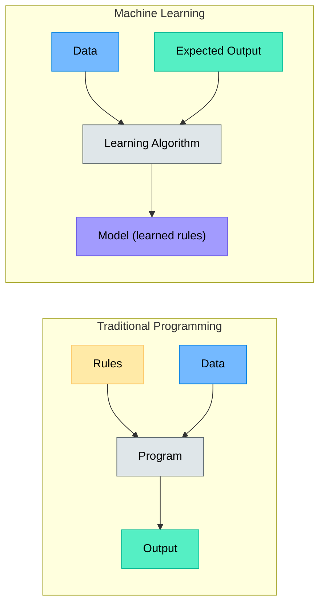
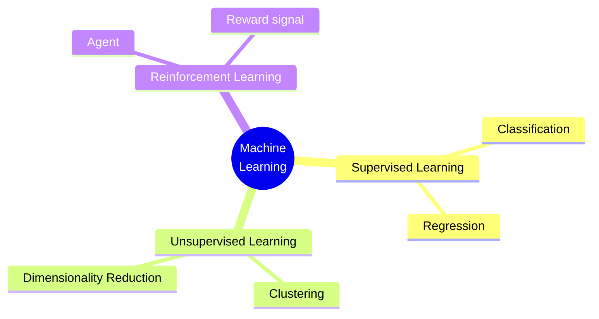
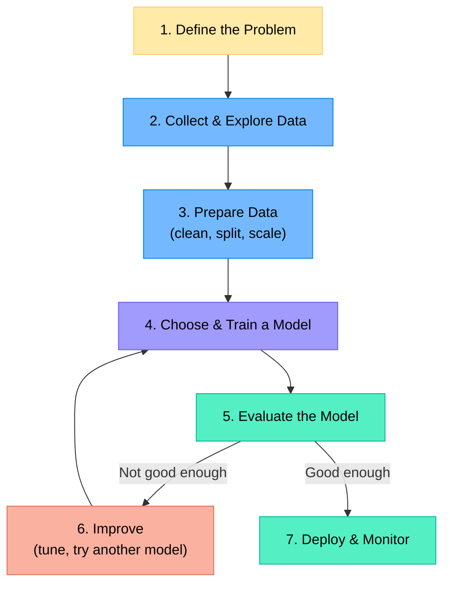
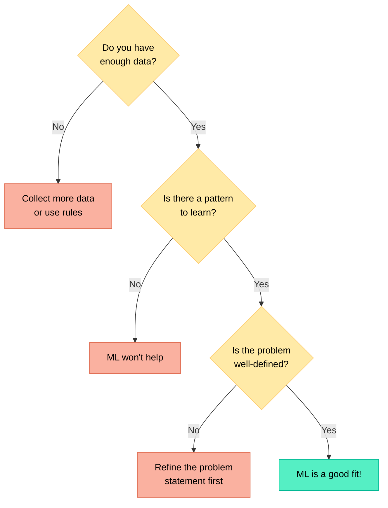
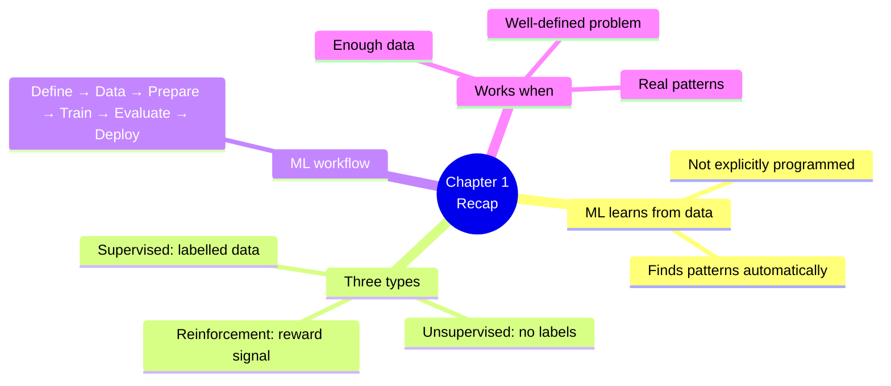

# Chapter 1 — What Is Machine Learning?

> **Learning objectives:** Understand what machine learning is, how it differs from traditional programming, identify the main types of learning, and see where ML is used in the real world.

---

## 1.1 Definitions and Everyday Examples

**Machine learning (ML)** is a field of computer science where programs learn patterns from data instead of being explicitly programmed with rules.

> "A computer program is said to learn from experience $E$ with respect to some task $T$ and performance measure $P$, if its performance on $T$, as measured by $P$, improves with experience $E$."
> — Tom Mitchell, 1997

### You already use ML every day

| Application | What the ML model does |
|:------------|:----------------------|
| Email spam filter | Classifies emails as "spam" or "not spam" |
| Netflix / YouTube | Recommends movies or videos you might like |
| Voice assistants (Siri, Alexa) | Converts speech to text |
| Auto-correct on your phone | Predicts the next word you'll type |
| Google Photos | Recognises faces in your pictures |
| Maps / GPS | Predicts traffic and travel time |

### The key idea

Instead of writing explicit rules, we **show the computer examples** and let it figure out the pattern.

---

## 1.2 Why Machine Learning? (vs. Traditional Programming)

Some problems are **too complex** or **too dynamic** to write rules for by hand.

| Scenario | Traditional Programming | Machine Learning |
|:---------|:-----------------------|:-----------------|
| Detecting spam emails | Write hundreds of rules ("contains 'free money'", etc.) — spammers adapt | Learn patterns from millions of emails — model adapts too |
| Recognising cats in photos | How would you even write the rules? | Show thousands of cat/non-cat photos, model learns |
| Translating languages | Grammar rules + dictionary — rigid, poor quality | Learn from millions of translated sentence pairs |

**ML shines when:**
- The problem has **lots of data** but rules are hard to define
- The patterns **change over time** (fraud detection, user preferences)
- The problem is too **complex for humans** to articulate (image recognition)

---

## 1.3 Types of Learning

There are three main families. In this guide we focus on the first two.

### Supervised Learning

The dataset contains **inputs AND the correct answers** (labels).

- **Classification** — Predict a category: spam/not spam, cat/dog, digit 0–9
- **Regression** — Predict a number: house price, temperature tomorrow

| Input (features) | Output (label) | Task type |
|:-----------------|:---------------|:----------|
| Email text | Spam / Not spam | Classification |
| House size, location | Price (€) | Regression |
| Patient symptoms | Diagnosis | Classification |
| Student hours studied | Exam score | Regression |

### Unsupervised Learning

The dataset contains **inputs only — no labels**. The model discovers hidden structure.

- **Clustering** — Group similar items (customer segments, document topics)
- **Dimensionality reduction** — Compress data while preserving key information

### Reinforcement Learning (just to know it exists)

An **agent** interacts with an environment, takes actions, and receives **rewards or penalties**. It learns a strategy (policy) that maximises cumulative reward. Used in game-playing AI, robotics, and self-driving cars. *We will not cover RL in this guide.*

---

## 1.4 The ML Workflow at a Glance

Every ML project follows roughly the same steps:

We will explore each step in detail throughout this guide:

| Step | Where you'll learn it |
|:-----|:---------------------|
| Define the problem | Chapter 12 |
| Collect & explore data | Chapter 2 |
| Prepare data | Chapter 2 |
| Choose & train a model | Chapters 4–11 |
| Evaluate the model | Chapter 3 |
| Improve | Chapter 3, 12 |
| Deploy & monitor | Chapter 12 (overview) |

---

## 1.5 When ML Works and When It Doesn't

### ML works well when

- You have **enough data** (hundreds to millions of examples depending on the problem)
- There is a **real pattern** to learn (not random noise)
- The task is **well-defined** (clear input → clear output)
- Traditional approaches are too **costly or complex**

### ML does NOT work well when

- **Very little data** is available (10 examples won't do)
- The problem can be solved with a **simple formula or rule**
- You need **100% guaranteed correctness** (ML is probabilistic)
- The data is **biased or unrepresentative** — the model will learn the bias

---

## 1.6 Key Terminology

| Term | Meaning |
|:-----|:--------|
| **Feature** | An input variable (e.g., house size, pixel value) |
| **Label / Target** | The correct answer we want to predict |
| **Sample / Instance** | One row of data (one email, one image) |
| **Training** | The process of learning from data |
| **Model** | The learned function that maps inputs to outputs |
| **Prediction / Inference** | Using the trained model on new, unseen data |
| **Dataset** | The collection of samples used for training and evaluation |

---

## Summary

---

## Exercises

1. **List 3 ML applications** you used today. For each, decide: is it classification, regression, or unsupervised?
2. **Supervised or unsupervised?** A streaming service groups its users into segments based on viewing habits, without predefined categories.
3. **Would ML help?** A company wants to predict which customers will cancel their subscription next month. They have 5 years of customer data. Why or why not?
4. **Traditional vs. ML:** You want to convert temperatures from Celsius to Fahrenheit. Would you use ML? Explain.
5. **Vocabulary check:** In the sentence "We trained a model on 10,000 emails, each labelled spam or not spam, to predict whether new emails are spam" — identify the features, labels, samples, and model.
