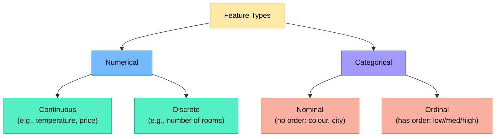
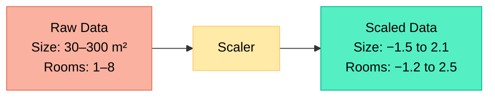
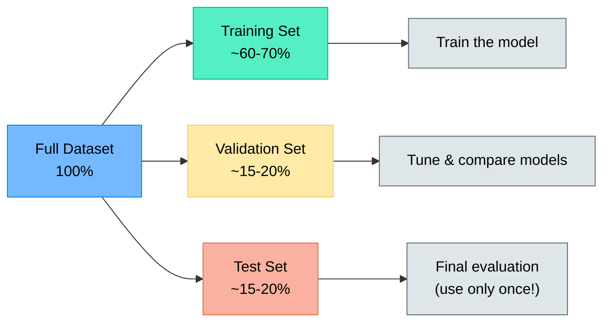
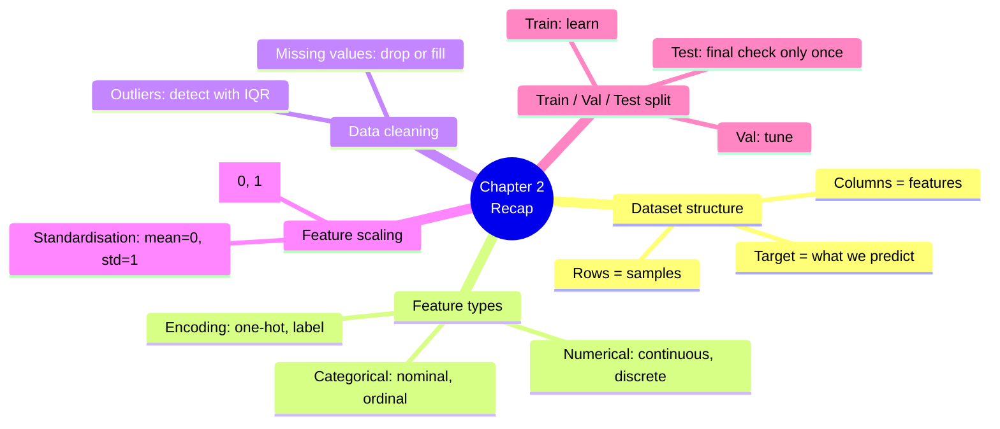

# Chapter 2 — Working with Data

> **Learning objectives:** Understand what a dataset looks like, distinguish feature types, handle messy data, scale features, split data properly, and explore a real dataset with Pandas.

---

## 2.1 What Is a Dataset?

A dataset is a **table** where:

- Each **row** is one sample (also called instance or observation)
- Each **column** is one feature (also called variable or attribute)
- One special column (in supervised learning) is the **target / label**

| House # | Size (m²) | Bedrooms | Garden | City     | Price (€) ← target |
|:--------|:----------|:---------|:-------|:---------|:--------------------|
| 1       | 85        | 2        | No     | Lyon     | 210,000             |
| 2       | 120       | 3        | Yes    | Paris    | 450,000             |
| 3       | 60        | 1        | No     | Marseille| 140,000             |

**Vocabulary recap:**

| Term | In the table above |
|:-----|:-------------------|
| Sample | One row (e.g., House #1) |
| Feature | Size, Bedrooms, Garden, City |
| Target | Price |
| Dataset size | 3 samples × 4 features |

---

## 2.2 Types of Features



### Why it matters

Most ML algorithms work with **numbers**. Categorical features must be converted:

| Encoding method | What it does | Example |
|:----------------|:------------|:--------|
| **Label encoding** | Assigns an integer to each category | Red→0, Blue→1, Green→2 |
| **One-hot encoding** | Creates one binary column per category | Red→[1,0,0], Blue→[0,1,0] |

> **Rule of thumb:** Use one-hot encoding for nominal features (no order). Label encoding can work for ordinal features.

```python
import pandas as pd

df = pd.DataFrame({"city": ["Lyon", "Paris", "Marseille", "Lyon"]})

# One-hot encoding
pd.get_dummies(df, columns=["city"])
#    city_Lyon  city_Marseille  city_Paris
# 0          1               0           0
# 1          0               0           1
# 2          0               1           0
# 3          1               0           0
```

---

## 2.3 Handling Missing Values and Outliers

Real-world data is **messy**. Two common problems:

### Missing values

| Strategy | When to use | Code |
|:---------|:-----------|:-----|
| **Drop rows** | Very few rows are affected | `df.dropna()` |
| **Drop columns** | A column is mostly empty | `df.drop(columns=["col"])` |
| **Fill with mean/median** | Numerical features | `df["col"].fillna(df["col"].median())` |
| **Fill with mode** | Categorical features | `df["col"].fillna(df["col"].mode()[0])` |

```python
# Check for missing values
print(df.isnull().sum())

# Fill missing age with median
df["age"] = df["age"].fillna(df["age"].median())
```

### Outliers

An **outlier** is a value that is abnormally far from the rest.

**How to detect them:**
- Plot a **box plot** — points beyond the whiskers are potential outliers
- Use the **IQR rule**: anything below $Q_1 - 1.5 \times IQR$ or above $Q_3 + 1.5 \times IQR$

**How to handle them:**
- Investigate first — is it a data error or a genuine rare event?
- Remove if clearly erroneous
- Keep if the outlier is real and informative

---

## 2.4 Feature Scaling: Why and How

Many algorithms (k-NN, linear regression, neural networks) are **sensitive to feature scales**. A feature in the range [0, 1000] will dominate a feature in [0, 1].

### Two common methods

| Method | Formula | Result range | When to use |
|:-------|:--------|:------------|:-----------|
| **Min-Max scaling** (normalisation) | $x' = \frac{x - x_{\min}}{x_{\max} - x_{\min}}$ | [0, 1] | When you need bounded values |
| **Standardisation** (z-score) | $x' = \frac{x - \mu}{\sigma}$ | ~[−3, 3] | When data is roughly normal |

```python
from sklearn.preprocessing import StandardScaler, MinMaxScaler

scaler = StandardScaler()
X_scaled = scaler.fit_transform(X)
```



> **Important:** Fit the scaler on **training data only**, then apply the same transformation to validation and test data. Otherwise you "leak" information from the test set.

---

## 2.5 Splitting Data: Train, Validation, Test

You cannot evaluate a model on the same data it was trained on — it would memorise the answers. We split the data into separate sets.



| Set | Purpose | Typical size |
|:----|:--------|:------------|
| **Training** | Model learns patterns from this data | 60–80% |
| **Validation** | Used to tune settings and compare models | 10–20% |
| **Test** | Final, unbiased performance estimate | 10–20% |

```python
from sklearn.model_selection import train_test_split

# First split: separate test set
X_train_val, X_test, y_train_val, y_test = train_test_split(
    X, y, test_size=0.2, random_state=42
)

# Second split: separate validation from training
X_train, X_val, y_train, y_val = train_test_split(
    X_train_val, y_train_val, test_size=0.25, random_state=42
)
# Result: 60% train, 20% val, 20% test
```

> **Golden rule:** The test set is like a sealed exam paper — look at it **only once**, at the very end.

---

## 2.6 Hands-On: Loading and Exploring a Dataset with Pandas

Let's explore the **Penguins** dataset — a beginner-friendly alternative to Iris.

```python
import pandas as pd
import seaborn as sns
import matplotlib.pyplot as plt

# Load dataset
df = sns.load_dataset("penguins")

# First look
print(df.shape)          # (344, 7)
print(df.head())
print(df.info())         # types and missing values
print(df.describe())     # statistics for numerical columns

# Check missing values
print(df.isnull().sum())

# Drop rows with missing values (simple approach)
df = df.dropna()
print(df.shape)          # (333, 7)
```

### Quick visualisations

```python
# Distribution of a numerical feature
df["bill_length_mm"].hist(bins=30)
plt.xlabel("Bill Length (mm)")
plt.ylabel("Count")
plt.title("Distribution of Bill Length")
plt.show()

# Relationship between two features, coloured by species
sns.scatterplot(data=df, x="bill_length_mm", y="bill_depth_mm", hue="species")
plt.title("Bill Length vs. Depth by Species")
plt.show()

# Correlation matrix
numerical_cols = df.select_dtypes(include="number")
print(numerical_cols.corr().round(2))
```

### Prepare for ML

```python
from sklearn.preprocessing import LabelEncoder, StandardScaler
from sklearn.model_selection import train_test_split

# Encode the target
le = LabelEncoder()
df["species_encoded"] = le.fit_transform(df["species"])

# Select features and target
features = ["bill_length_mm", "bill_depth_mm", "flipper_length_mm", "body_mass_g"]
X = df[features]
y = df["species_encoded"]

# Scale features
scaler = StandardScaler()
X_scaled = scaler.fit_transform(X)

# Split
X_train, X_test, y_train, y_test = train_test_split(
    X_scaled, y, test_size=0.2, random_state=42
)
print(f"Training: {X_train.shape[0]} samples, Test: {X_test.shape[0]} samples")
```

---

## Summary



---

## Exercises

1. **Feature types:** For each feature, state its type (continuous, discrete, nominal, ordinal): (a) temperature in °C, (b) T-shirt size (S/M/L/XL), (c) country of birth, (d) number of siblings.
2. **Missing values:** A dataset has 1,000 rows. The column `income` is missing for 5 rows. The column `favourite_colour` is missing for 700 rows. What would you do for each column?
3. **Scaling exercise:** Given the values [10, 20, 30, 40, 50], compute by hand the min-max scaled and standardised versions.
4. **Data leakage:** Explain in your own words why you should **not** fit the scaler on the entire dataset before splitting.
5. **Hands-on:** Load the Titanic dataset (`sns.load_dataset("titanic")`), check for missing values, decide how to handle them, encode categorical features, and split into train/test.
