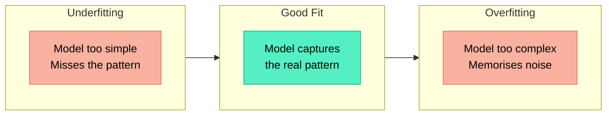
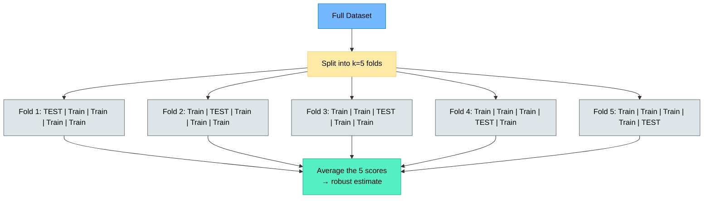
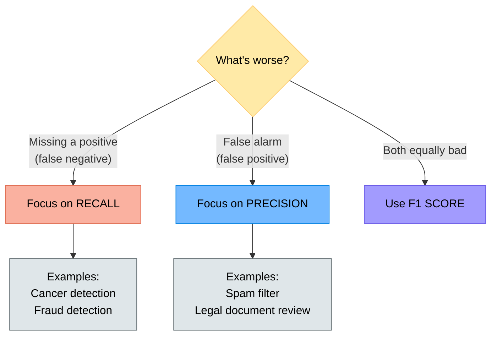
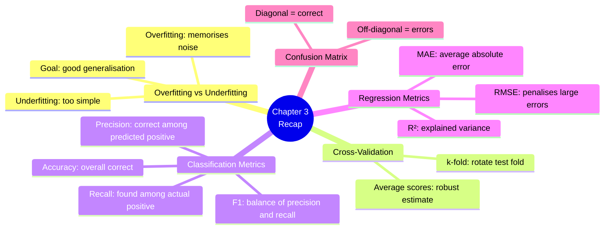

# Chapter 3 — How Do We Know a Model Is Good?

> **Learning objectives:** Understand overfitting and underfitting, learn cross-validation, master the key metrics for classification and regression, and read a confusion matrix.

---

## 3.1 Accuracy Is Not Enough

Imagine a medical test for a rare disease that affects **1 in 1,000** people. A model that **always predicts "healthy"** achieves **99.9% accuracy** — yet it completely fails at its real purpose.

This shows that a single number like accuracy can be **misleading**, especially with imbalanced data. We need better tools.

---

## 3.2 Overfitting vs. Underfitting

The central challenge of ML: finding the sweet spot between too simple and too complex.



| | Underfitting | Good fit | Overfitting |
|:--|:------------|:---------|:------------|
| **Training performance** | Poor | Good | Excellent |
| **Test performance** | Poor | Good | Poor |
| **What happened** | Model didn't learn enough | Model learned the real pattern | Model memorised the training data, including noise |
| **Fix** | Use a more complex model, add features | — | Simplify model, add more data, regularise |

### Visual intuition

Think of fitting a curve through data points:

- **Underfitting:** A straight line through data that's clearly curved
- **Good fit:** A gentle curve that follows the main trend
- **Overfitting:** A wiggly curve that passes through every single point, including outliers

> **Key insight:** A model that performs much better on training data than on test data is **overfitting**.

---

## 3.3 Cross-Validation Made Simple

Instead of relying on a single train/test split (which can be "lucky" or "unlucky"), we use **k-fold cross-validation**.



**How it works (k=5):**

1. Split the dataset into 5 equal parts (folds)
2. Train on 4 folds, test on the remaining 1
3. Repeat 5 times, each time using a different fold as the test set
4. Average the 5 scores → more reliable performance estimate

```python
from sklearn.model_selection import cross_val_score
from sklearn.tree import DecisionTreeClassifier

model = DecisionTreeClassifier()
scores = cross_val_score(model, X, y, cv=5, scoring="accuracy")

print(f"Scores per fold: {scores}")
print(f"Mean accuracy: {scores.mean():.3f} ± {scores.std():.3f}")
```

> **Why 5 or 10 folds?** It's a good balance between reliability and computation time. 5-fold is common for larger datasets, 10-fold for smaller ones.

---

## 3.4 Classification Metrics

### The Confusion Matrix

For a **binary** classifier (e.g., spam / not spam):

|  | Predicted: Positive | Predicted: Negative |
|:--|:-------------------|:-------------------|
| **Actual: Positive** | TP (True Positive) ✅ | FN (False Negative) ❌ |
| **Actual: Negative** | FP (False Positive) ❌ | TN (True Negative) ✅ |

- **TP:** Correctly predicted positive (spam email correctly flagged)
- **TN:** Correctly predicted negative (normal email correctly let through)
- **FP:** Incorrectly predicted positive — **false alarm** (normal email flagged as spam)
- **FN:** Incorrectly predicted negative — **missed** (spam email not caught)

### The four key metrics

$$\text{Accuracy} = \frac{TP + TN}{TP + TN + FP + FN}$$

$$\text{Precision} = \frac{TP}{TP + FP} \quad \text{("Of all positive predictions, how many were correct?")}$$

$$\text{Recall} = \frac{TP}{TP + FN} \quad \text{("Of all actual positives, how many did we find?")}$$

$$\text{F1 Score} = 2 \times \frac{\text{Precision} \times \text{Recall}}{\text{Precision} + \text{Recall}} \quad \text{(harmonic mean)}$$

### When to care about which metric



### Worked example

A spam filter on 100 emails:

| | Predicted: Spam | Predicted: Not Spam |
|:--|:---------------|:-------------------|
| **Actual: Spam** | TP = 40 | FN = 10 |
| **Actual: Not Spam** | FP = 5 | TN = 45 |

$$\text{Accuracy} = \frac{40 + 45}{100} = 0.85 = 85\%$$

$$\text{Precision} = \frac{40}{40 + 5} = 0.889 = 88.9\%$$

$$\text{Recall} = \frac{40}{40 + 10} = 0.80 = 80\%$$

$$\text{F1} = 2 \times \frac{0.889 \times 0.80}{0.889 + 0.80} = 0.842 = 84.2\%$$

```python
from sklearn.metrics import classification_report, confusion_matrix

# After training and predicting:
print(confusion_matrix(y_test, y_pred))
print(classification_report(y_test, y_pred))
```

---

## 3.5 Regression Metrics

For regression (predicting a continuous number), we use different metrics.

Given $n$ predictions $\hat{y}_i$ and true values $y_i$:

### Mean Absolute Error (MAE)

$$\text{MAE} = \frac{1}{n} \sum_{i=1}^{n} |y_i - \hat{y}_i|$$

Average absolute distance between prediction and truth. Easy to interpret: "On average, we are off by X units."

### Mean Squared Error (MSE)

$$\text{MSE} = \frac{1}{n} \sum_{i=1}^{n} (y_i - \hat{y}_i)^2$$

Penalises large errors more heavily (because of squaring).

### Root Mean Squared Error (RMSE)

$$\text{RMSE} = \sqrt{\text{MSE}}$$

Same units as the target — easier to interpret than MSE.

### R² Score (Coefficient of Determination)

$$R^2 = 1 - \frac{\sum (y_i - \hat{y}_i)^2}{\sum (y_i - \bar{y})^2}$$

- $R^2 = 1$: perfect predictions
- $R^2 = 0$: model is no better than predicting the mean
- $R^2 < 0$: model is worse than the mean (something is very wrong)

```python
from sklearn.metrics import mean_absolute_error, mean_squared_error, r2_score
import numpy as np

mae = mean_absolute_error(y_test, y_pred)
mse = mean_squared_error(y_test, y_pred)
rmse = np.sqrt(mse)
r2 = r2_score(y_test, y_pred)

print(f"MAE: {mae:.2f}, RMSE: {rmse:.2f}, R²: {r2:.3f}")
```

---

## 3.6 The Confusion Matrix — Deeper Look

For **multi-class** problems, the confusion matrix extends naturally:

```python
from sklearn.metrics import ConfusionMatrixDisplay
import matplotlib.pyplot as plt

ConfusionMatrixDisplay.from_predictions(y_test, y_pred, display_labels=class_names)
plt.title("Confusion Matrix")
plt.show()
```

### Reading a multi-class confusion matrix

|  | Pred: Adelie | Pred: Chinstrap | Pred: Gentoo |
|:--|:------------|:---------------|:-------------|
| **True: Adelie** | 28 | 2 | 0 |
| **True: Chinstrap** | 3 | 12 | 1 |
| **True: Gentoo** | 0 | 0 | 21 |

- **Diagonal** = correct predictions (28 + 12 + 21 = 61 correct)
- **Off-diagonal** = errors (3 Chinstraps misclassified as Adelie, etc.)
- Each row tells you where the true class ended up
- Each column tells you what ended up in each predicted class

---

## 3.7 Hands-On: Evaluating a Model with scikit-learn

```python
from sklearn.datasets import load_wine
from sklearn.model_selection import train_test_split, cross_val_score
from sklearn.tree import DecisionTreeClassifier
from sklearn.metrics import classification_report, confusion_matrix
import numpy as np

# Load data
X, y = load_wine(return_X_y=True)
target_names = load_wine().target_names

# Split
X_train, X_test, y_train, y_test = train_test_split(
    X, y, test_size=0.2, random_state=42
)

# Train a simple model
model = DecisionTreeClassifier(random_state=42)
model.fit(X_train, y_train)

# Evaluate on test set
y_pred = model.predict(X_test)
print("Confusion Matrix:")
print(confusion_matrix(y_test, y_pred))
print("\nClassification Report:")
print(classification_report(y_test, y_pred, target_names=target_names))

# Cross-validation for a more robust estimate
cv_scores = cross_val_score(model, X, y, cv=5, scoring="accuracy")
print(f"\n5-Fold CV Accuracy: {cv_scores.mean():.3f} ± {cv_scores.std():.3f}")
```

**What to look for:**
- Is accuracy similar across folds? (If not, the data may have structure issues)
- Is train accuracy much higher than test accuracy? → **overfitting**
- Is precision/recall balanced, or is one class much worse? → **class imbalance**

---

## Summary



---

## Exercises

1. **Overfitting diagnosis:** A model has 99% training accuracy and 65% test accuracy. Is it overfitting or underfitting? What would you try to fix it?
2. **Metric choice:** You're building a model to detect fraudulent bank transactions (1% of all transactions are fraud). Why is accuracy a bad metric here? Which metric matters more: precision or recall?
3. **Compute by hand:** Given this confusion matrix, calculate accuracy, precision, recall, and F1:

   |  | Pred: + | Pred: − |
   |:--|:--------|:--------|
   | **Actual: +** | 30 | 20 |
   | **Actual: −** | 10 | 40 |

4. **Regression metrics:** A model predicts house prices. The predictions for 4 houses are: [200k, 350k, 150k, 400k]. The true prices are: [210k, 340k, 160k, 380k]. Calculate the MAE and MSE by hand.
5. **Cross-validation:** Why is 5-fold cross-validation more reliable than a single train/test split? When might you use more or fewer folds?
