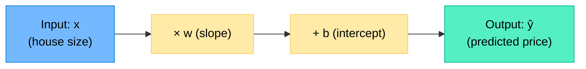
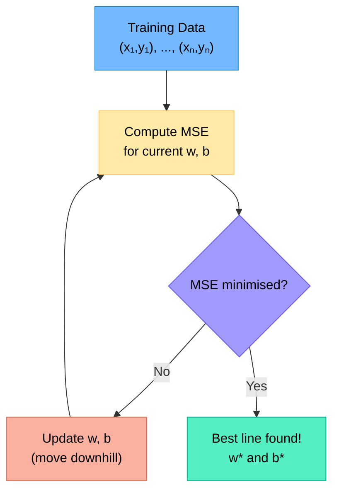
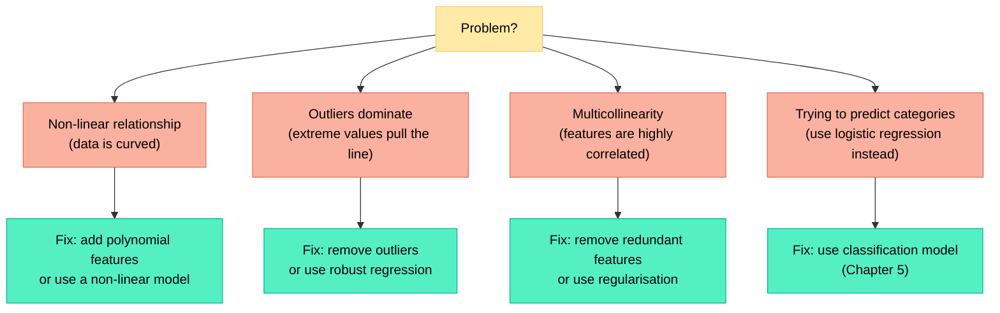
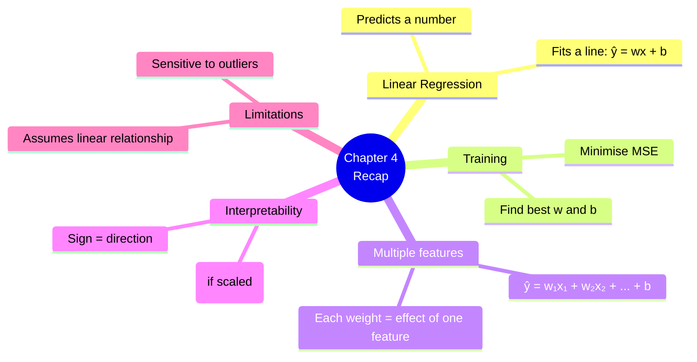

# Chapter 4 — Linear Regression

> **Learning objectives:** Understand how a straight line is fitted to data, interpret model coefficients, extend to multiple features, and build a regression model with scikit-learn.

---

## 4.1 The Idea: Fitting a Line Through Points

Linear regression is the simplest supervised learning algorithm. The goal is to predict a **continuous number** (e.g., price, temperature) from input features.

For one feature $x$, we fit a line:

$$\hat{y} = w \cdot x + b$$

| Symbol | Meaning |
|:-------|:--------|
| $x$ | Input feature (e.g., house size in m²) |
| $\hat{y}$ | Predicted output (e.g., predicted price) |
| $w$ | **Weight** (slope) — how much $\hat{y}$ changes when $x$ increases by 1 |
| $b$ | **Bias** (intercept) — the prediction when $x = 0$ |



**Example:** If $w = 3000$ and $b = 50000$, the model predicts:

$$\hat{y} = 3000 \times x + 50000$$

A house of 80 m² → $\hat{y} = 3000 \times 80 + 50000 = 290,000$ €

---

## 4.2 Least Squares — How the Line Is Found

The algorithm finds the values of $w$ and $b$ that **minimise the total error** on the training data.

### The error: residuals

For each training point $i$, the **residual** is the difference between the true value and the prediction:

$$\text{residual}_i = y_i - \hat{y}_i$$

### The cost function: Mean Squared Error

We want to minimise the average of all squared residuals:

$$\text{MSE} = \frac{1}{n} \sum_{i=1}^{n} (y_i - \hat{y}_i)^2 = \frac{1}{n} \sum_{i=1}^{n} (y_i - (w \cdot x_i + b))^2$$

**Why squared?**
- Squaring makes all errors positive (no cancelling out)
- Larger errors get penalised more heavily
- The math works out nicely (smooth, differentiable function)



> **Good news:** For linear regression, there is a direct formula to find the best $w$ and $b$ without iterating. But the iterative idea (gradient descent) will come back in later chapters.

---

## 4.3 Multiple Features (Multiple Linear Regression)

Most real problems have **more than one feature**. The model becomes:

$$\hat{y} = w_1 x_1 + w_2 x_2 + \dots + w_p x_p + b$$

| Feature ($x_j$) | Weight ($w_j$) | Meaning |
|:-----------------|:---------------|:--------|
| Size (m²) | $w_1 = 2500$ | Each extra m² adds 2,500 € |
| Bedrooms | $w_2 = 15000$ | Each extra bedroom adds 15,000 € |
| Distance to metro (km) | $w_3 = -8000$ | Each extra km reduces price by 8,000 € |
| Intercept | $b = 30000$ | Base price |

**Prediction:** A house of 90 m², 3 bedrooms, 2 km from the metro:

$$\hat{y} = 2500 \times 90 + 15000 \times 3 + (-8000) \times 2 + 30000 = 289,000 \text{ €}$$

---

## 4.4 Interpreting Coefficients

This is one of linear regression's greatest strengths: the model is **easy to explain**.

| What to look at | What it tells you |
|:----------------|:------------------|
| **Sign of $w_j$** | Positive → feature increases prediction; Negative → decreases it |
| **Magnitude of $w_j$** | How much the prediction changes per unit change in $x_j$ *(only meaningful if features are on the same scale)* |
| **Intercept $b$** | Predicted value when all features are 0 (sometimes not meaningful) |

> **Warning:** Comparing raw magnitudes only makes sense if features are **standardised** (Chapter 2). Otherwise a weight of 2,500 on "size in m²" is not comparable to a weight of 15,000 on "bedrooms" — they have different units.

### After standardisation

If you standardise all features (mean=0, std=1), then the weights directly show **relative importance**: the larger the absolute value of $w_j$, the more important that feature.

---

## 4.5 When Linear Regression Fails

Linear regression assumes a **linear relationship** between features and target. It won't work well when:



### Quick check: plot your data first!

Always visualise features vs. target **before** training. If the relationship is clearly curved, linear regression won't capture it.

---

## 4.6 Hands-On: Predicting House Prices

```python
import numpy as np
import pandas as pd
import matplotlib.pyplot as plt
from sklearn.datasets import fetch_california_housing
from sklearn.model_selection import train_test_split
from sklearn.linear_model import LinearRegression
from sklearn.metrics import mean_absolute_error, r2_score

# --- Load data ---
data = fetch_california_housing(as_frame=True)
df = data.frame
print(df.head())
print(f"\nShape: {df.shape}")
print(f"Target: median house value (in $100k)")

# --- Select a few features for simplicity ---
features = ["MedInc", "AveRooms", "HouseAge"]
X = df[features]
y = df["MedHouseVal"]

# --- Split ---
X_train, X_test, y_train, y_test = train_test_split(
    X, y, test_size=0.2, random_state=42
)

# --- Train ---
model = LinearRegression()
model.fit(X_train, y_train)

# --- Inspect coefficients ---
print("\nCoefficients:")
for name, coef in zip(features, model.coef_):
    print(f"  {name}: {coef:.4f}")
print(f"  Intercept: {model.intercept_:.4f}")

# --- Evaluate ---
y_pred = model.predict(X_test)
print(f"\nMAE: ${mean_absolute_error(y_test, y_pred) * 100_000:.0f}")
print(f"R² score: {r2_score(y_test, y_pred):.3f}")

# --- Visualise predictions vs actual ---
plt.figure(figsize=(8, 5))
plt.scatter(y_test, y_pred, alpha=0.3, s=10)
plt.plot([0, 5], [0, 5], "r--", label="Perfect prediction")
plt.xlabel("Actual Price ($100k)")
plt.ylabel("Predicted Price ($100k)")
plt.title("Linear Regression: Predicted vs. Actual")
plt.legend()
plt.tight_layout()
plt.show()
```

**Expected output:** The model achieves an R² of about 0.5 — meaning it explains roughly half the variance. This is expected: house prices depend on many factors not captured by 3 features.

### Things to try

- Add more features and see if R² improves
- Plot residuals (`y_test - y_pred`) — are they random, or is there a pattern?
- Compare with a baseline: always predicting the mean price

---

## Summary



---

## Exercises

1. **By hand:** Given the model $\hat{y} = 5x + 10$ and two data points $(x=2, y=22)$ and $(x=4, y=28)$, compute the residual and squared error for each point, then the MSE.
2. **Interpretation:** A model trained on standardised features gives weights: `temperature: 0.7`, `humidity: -0.3`, `wind_speed: 0.1`. Which feature is most important? Which feature decreases the prediction?
3. **Prediction:** A model predicts apartment rent: $\hat{y} = 12 \times \text{size} + 50 \times \text{floor} - 20 \times \text{distance\_centre} + 200$. Predict the rent for a 45 m² apartment on floor 3, at 5 km from the centre.
4. **Would linear regression work?** You plot hours studied vs. exam score and see a clear S-shaped curve. Is linear regression appropriate? Why or why not?
5. **Hands-on:** Extend the California housing example to use all 8 features. Does R² improve? Which features have the largest coefficients after standardisation?
