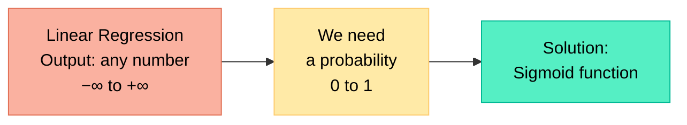
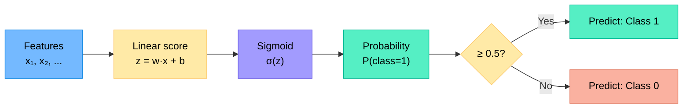
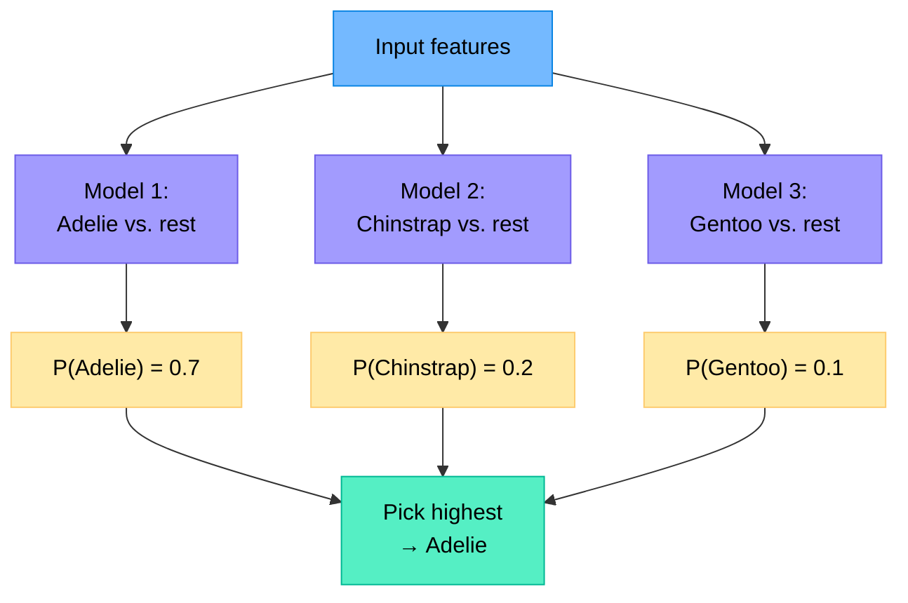
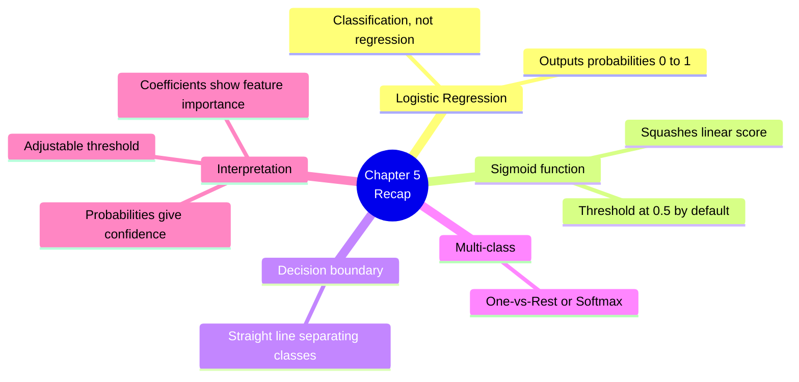

# Chapter 5 — Logistic Regression and Classification

> **Learning objectives:** Understand how regression is adapted for classification, learn the sigmoid function, interpret probabilities and decision boundaries, and classify data with scikit-learn.

---

## 5.1 From Regression to Classification

In Chapter 4 we predicted **continuous numbers**. Now we want to predict **categories**: spam/not spam, cat/dog, digit 0–9.

**Why not just use linear regression?**

If you assign spam=1 and not-spam=0, linear regression can predict values like 0.7 or −0.3 — but those aren't valid probabilities. We need a function that **squashes** the output into the range [0, 1].



---

## 5.2 The Sigmoid Function and Decision Boundary

### The sigmoid (logistic) function

$$\sigma(z) = \frac{1}{1 + e^{-z}}$$

| Input $z$ | Output $\sigma(z)$ | Interpretation |
|:----------|:-------------------|:---------------|
| Very negative (−10) | ≈ 0 | Very likely class 0 |
| 0 | 0.5 | Uncertain — right at the boundary |
| Very positive (+10) | ≈ 1 | Very likely class 1 |

### How logistic regression works

1. Compute a linear score: $z = w_1 x_1 + w_2 x_2 + \dots + b$
2. Pass it through the sigmoid: $P(\text{class} = 1) = \sigma(z)$
3. Apply a threshold (usually 0.5):
   - If $\sigma(z) \geq 0.5$ → predict class 1
   - If $\sigma(z) < 0.5$ → predict class 0



### The decision boundary

The boundary is where $\sigma(z) = 0.5$, which happens when $z = 0$:

$$w_1 x_1 + w_2 x_2 + b = 0$$

This is a **straight line** (in 2D) or a **hyperplane** (in higher dimensions) that separates the two classes.

### The loss function: Binary Cross-Entropy

Unlike MSE used in linear regression, logistic regression uses a different loss:

$$\text{Loss} = -\frac{1}{n} \sum_{i=1}^{n} \left[ y_i \log(\hat{p}_i) + (1 - y_i) \log(1 - \hat{p}_i) \right]$$

**Intuition:**
- If the true label is 1 and the model predicts $\hat{p} = 0.99$ → low loss (good!)
- If the true label is 1 and the model predicts $\hat{p} = 0.01$ → very high loss (bad!)

---

## 5.3 Multi-Class Classification

What if there are more than 2 classes (e.g., Adelie, Chinstrap, Gentoo)?

### One-vs-Rest (OvR)

Train **one logistic regression per class**, each answering: "Is it this class or not?"



### Softmax (multinomial)

An alternative: compute scores for **all classes at once** and convert them to probabilities using the **softmax** function:

$$P(\text{class } k) = \frac{e^{z_k}}{\sum_{j=1}^{K} e^{z_j}}$$

All probabilities sum to 1. scikit-learn's `LogisticRegression` handles multi-class automatically.

---

## 5.4 Interpreting Probabilities

One advantage of logistic regression: it outputs **probabilities**, not just a class label.

```python
# Get probabilities instead of just the class
proba = model.predict_proba(X_test)
print(proba[:5])
# [[0.02, 0.95, 0.03],   ← very confident: class 1
#  [0.40, 0.35, 0.25],   ← uncertain: close probabilities
#  ...]
```

**Why this matters:**
- You can **adjust the threshold**: e.g., in medical diagnosis, predict "sick" if $P > 0.3$ instead of $0.5$ (increases recall at the cost of precision)
- You can **measure confidence**: if the highest probability is only 0.4, the model is unsure
- You can **rank predictions**: sort by probability for targeted action (e.g., most likely churning customers first)

---

## 5.5 Hands-On: Classifying Iris Species

```python
import numpy as np
import matplotlib.pyplot as plt
from sklearn.datasets import load_iris
from sklearn.model_selection import train_test_split
from sklearn.linear_model import LogisticRegression
from sklearn.metrics import classification_report, ConfusionMatrixDisplay
from sklearn.preprocessing import StandardScaler

# --- Load data ---
iris = load_iris()
X = iris.data
y = iris.target
feature_names = iris.feature_names
target_names = iris.target_names

print(f"Features: {feature_names}")
print(f"Classes: {target_names}")
print(f"Shape: {X.shape}")

# --- Scale features ---
scaler = StandardScaler()
X_scaled = scaler.fit_transform(X)

# --- Split ---
X_train, X_test, y_train, y_test = train_test_split(
    X_scaled, y, test_size=0.2, random_state=42
)

# --- Train ---
model = LogisticRegression(max_iter=200)
model.fit(X_train, y_train)

# --- Predict ---
y_pred = model.predict(X_test)

# --- Evaluate ---
print("\nClassification Report:")
print(classification_report(y_test, y_pred, target_names=target_names))

# --- Confusion matrix ---
ConfusionMatrixDisplay.from_predictions(
    y_test, y_pred, display_labels=target_names
)
plt.title("Logistic Regression — Iris")
plt.tight_layout()
plt.show()

# --- Look at probabilities ---
proba = model.predict_proba(X_test)
print("\nFirst 5 predictions (probabilities per class):")
for i in range(5):
    print(f"  True: {target_names[y_test[i]]}, "
          f"Pred: {target_names[y_pred[i]]}, "
          f"Proba: {proba[i].round(3)}")

# --- Inspect coefficients ---
print("\nCoefficients (per class, per feature):")
for i, cls in enumerate(target_names):
    print(f"  {cls}: {dict(zip(feature_names, model.coef_[i].round(3)))}")
```

**Expected results:**
- Accuracy ~97–100% on this easy dataset
- The confusion matrix shows very few errors
- Coefficients reveal which features separate which classes (e.g., petal length is very discriminative)

---

## Summary



---

## Exercises

1. **Sigmoid by hand:** Compute $\sigma(0)$, $\sigma(2)$, and $\sigma(-3)$. What do you notice about $\sigma(z) + \sigma(-z)$?
2. **Threshold:** A model outputs $P(\text{fraud}) = 0.35$. With a default threshold of 0.5, what does it predict? If you lower the threshold to 0.2, what changes? Discuss the trade-off.
3. **Linear vs. Logistic:** Why can't we use MSE as the loss function for logistic regression? (Hint: think about what $\hat{y}$ represents.)
4. **Multi-class:** You have 4 classes. With the One-vs-Rest approach, how many binary classifiers do you need?
5. **Hands-on:** Train a logistic regression on the Penguins dataset (from Chapter 2) to predict species from bill and flipper measurements. Report the classification metrics and inspect which features are most important.
