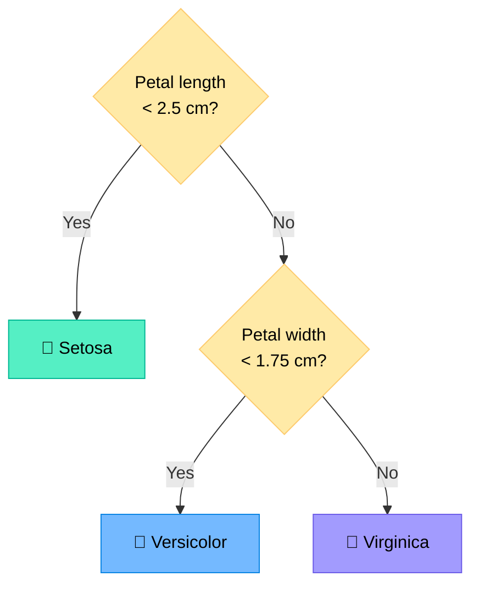
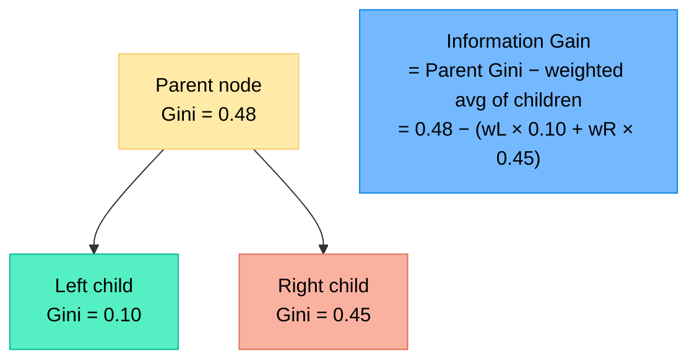
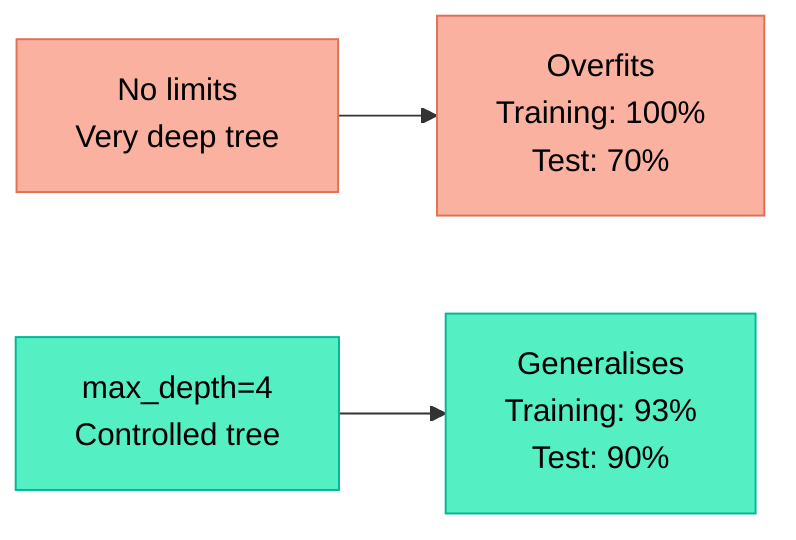
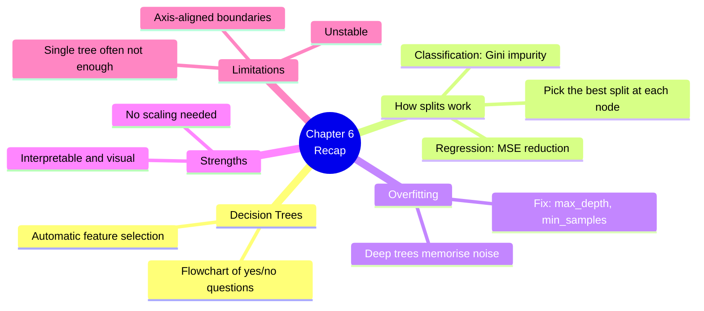

# Chapter 6 — Decision Trees

> **Learning objectives:** Understand how a tree makes decisions, learn how splits are chosen, compare trees for classification and regression, recognise overfitting in trees, and visualise a decision tree.

---

## 6.1 Intuition: A Flowchart for Decisions

A decision tree works exactly like a **flowchart** — it asks a series of yes/no questions about your data and arrives at a prediction.



### Anatomy of a tree

| Term | Meaning |
|:-----|:--------|
| **Root node** | The very first question (top of the tree) |
| **Internal node** | A question/test on a feature |
| **Branch** | The outcome of a test (yes/no, left/right) |
| **Leaf node** | A final prediction (no more questions) |
| **Depth** | Number of levels from root to the deepest leaf |

**Key insight:** The tree automatically selects the **best features** and the **best thresholds** to split on — you don't need to tell it what's important.

---

## 6.2 How Splits Are Chosen

At each node, the algorithm considers every feature and every possible threshold, and picks the split that **best separates the classes** (or reduces prediction error for regression).

### For classification: Gini Impurity

The **Gini impurity** measures how "mixed" a group is:

$$\text{Gini} = 1 - \sum_{k=1}^{K} p_k^2$$

where $p_k$ is the proportion of class $k$ in the group.

| Situation | Gini | Meaning |
|:----------|:-----|:--------|
| All samples are the same class | 0 | **Pure** — perfect split |
| Classes are equally mixed (2 classes, 50/50) | 0.5 | Maximum impurity |

**Example:** A group has 30 cats and 10 dogs.

$$p_{\text{cat}} = 30/40 = 0.75, \quad p_{\text{dog}} = 10/40 = 0.25$$

$$\text{Gini} = 1 - (0.75^2 + 0.25^2) = 1 - (0.5625 + 0.0625) = 0.375$$

### For classification: Information Gain (alternative)

Uses **entropy** instead of Gini:

$$\text{Entropy} = -\sum_{k=1}^{K} p_k \log_2(p_k)$$

- Entropy = 0 → pure group
- Entropy = 1 → maximum mix (binary case)

The algorithm picks the split that **reduces impurity the most** (= highest information gain).



### For regression: Variance reduction

Instead of Gini/Entropy, the tree minimises the **MSE** within each group. The prediction at each leaf is the **mean** of the samples in that leaf.

---

## 6.3 Trees for Classification vs. Regression

| | Classification Tree | Regression Tree |
|:--|:-------------------|:----------------|
| **Target** | Category (spam, species, ...) | Number (price, temperature, ...) |
| **Split criterion** | Gini impurity or Entropy | MSE (variance reduction) |
| **Leaf prediction** | Most common class (majority vote) | Mean of samples in the leaf |
| **scikit-learn class** | `DecisionTreeClassifier` | `DecisionTreeRegressor` |

```python
from sklearn.tree import DecisionTreeClassifier, DecisionTreeRegressor

# Classification
clf = DecisionTreeClassifier(max_depth=3)
clf.fit(X_train, y_train)

# Regression
reg = DecisionTreeRegressor(max_depth=3)
reg.fit(X_train, y_train)
```

---

## 6.4 Overfitting and Pruning

Decision trees have a major weakness: they can grow **very deep** and memorise every training sample.

### The problem

| Tree depth | Training accuracy | Test accuracy | What happened |
|:-----------|:-----------------|:-------------|:-------------|
| 2 | 85% | 83% | Underfitting slightly |
| 5 | 95% | 92% | Good balance |
| 20 | 100% | 70% | **Overfitting!** |

A tree with no depth limit will keep splitting until every leaf contains exactly one sample — perfect on training data, terrible on new data.

### The solution: limit tree complexity

| Parameter | What it does | Typical values |
|:----------|:-------------|:---------------|
| `max_depth` | Maximum number of levels | 3–10 |
| `min_samples_split` | Minimum samples needed to split a node | 5–20 |
| `min_samples_leaf` | Minimum samples in each leaf | 2–10 |

```python
# A well-controlled tree
model = DecisionTreeClassifier(
    max_depth=4,
    min_samples_leaf=5,
    random_state=42
)
```



---

## 6.5 Strengths and Limitations

| Strengths | Limitations |
|:----------|:-----------|
| Easy to understand and visualise | Prone to overfitting (without pruning) |
| No feature scaling needed | Unstable: small data changes → different tree |
| Handles both numerical and categorical features | Decision boundaries are always axis-aligned (can't capture diagonal patterns well) |
| Fast training and prediction | Single trees often not very accurate |
| Built-in feature importance | |

> **Spoiler:** The instability and accuracy problems are elegantly solved in Chapter 7 by combining many trees together (Random Forests and Boosting).

---

## 6.6 Hands-On: Visualising a Decision Tree

```python
import matplotlib.pyplot as plt
from sklearn.datasets import load_iris
from sklearn.tree import DecisionTreeClassifier, plot_tree
from sklearn.model_selection import train_test_split

# --- Load and split ---
iris = load_iris()
X_train, X_test, y_train, y_test = train_test_split(
    iris.data, iris.target, test_size=0.2, random_state=42
)

# --- Train a shallow tree ---
model = DecisionTreeClassifier(max_depth=3, random_state=42)
model.fit(X_train, y_train)

# --- Evaluate ---
train_acc = model.score(X_train, y_train)
test_acc = model.score(X_test, y_test)
print(f"Training accuracy: {train_acc:.3f}")
print(f"Test accuracy:     {test_acc:.3f}")

# --- Visualise the tree ---
plt.figure(figsize=(14, 8))
plot_tree(
    model,
    feature_names=iris.feature_names,
    class_names=iris.target_names,
    filled=True,
    rounded=True,
    fontsize=10
)
plt.title("Decision Tree — Iris (max_depth=3)")
plt.tight_layout()
plt.show()

# --- Feature importance ---
print("\nFeature importance:")
for name, imp in sorted(
    zip(iris.feature_names, model.feature_importances_),
    key=lambda x: x[1], reverse=True
):
    print(f"  {name}: {imp:.3f}")
```

### Try this: overfitting experiment

```python
# Compare: unlimited depth vs. controlled depth
for depth in [None, 2, 3, 5, 10]:
    m = DecisionTreeClassifier(max_depth=depth, random_state=42)
    m.fit(X_train, y_train)
    print(f"Depth={str(depth):>4s}  "
          f"Train: {m.score(X_train, y_train):.3f}  "
          f"Test: {m.score(X_test, y_test):.3f}")
```

You'll see that the unlimited tree gets 100% on training but may not improve on test — classic overfitting.

---

## Summary



---

## Exercises

1. **Gini by hand:** A node contains 20 cats and 30 dogs. Compute the Gini impurity.
2. **Which split is better?** Split A produces [15 cats, 2 dogs] and [5 cats, 28 dogs]. Split B produces [10 cats, 15 dogs] and [10 cats, 15 dogs]. Which split is better and why?
3. **Overfitting diagnosis:** A tree achieves 100% training accuracy and 72% test accuracy. What do you try first?
4. **Classification vs. Regression:** You want to predict the price of a used car. Do you use `DecisionTreeClassifier` or `DecisionTreeRegressor`? What will the leaf predictions look like?
5. **Hands-on:** Train decision trees of depths 1, 3, 5, 10, and None on the Penguins dataset. Plot training vs. test accuracy for each depth. At which depth does overfitting begin?
