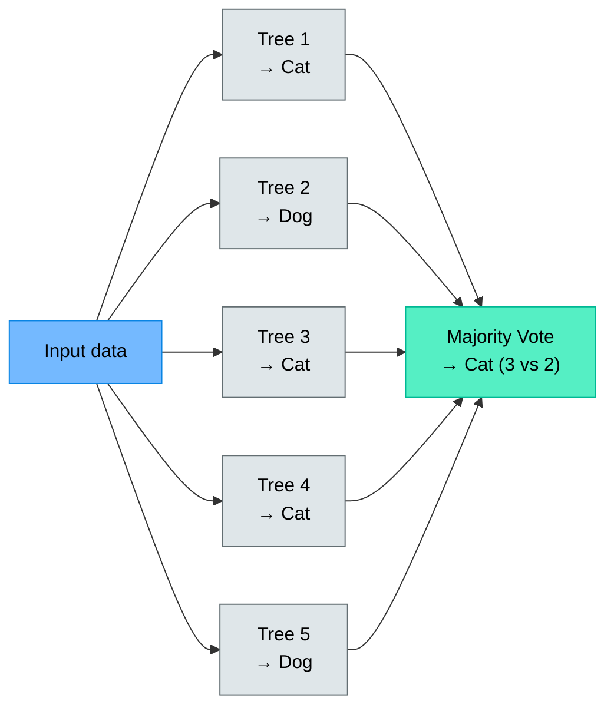
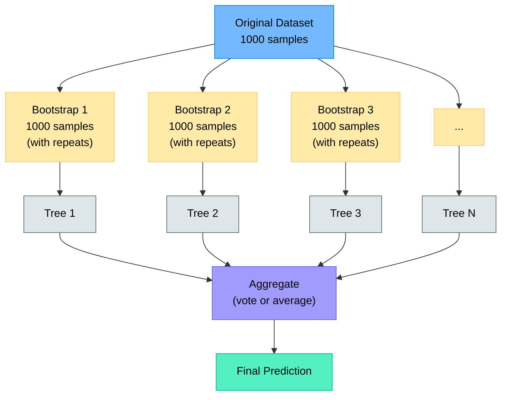
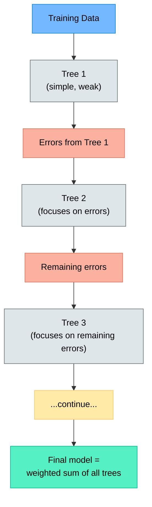
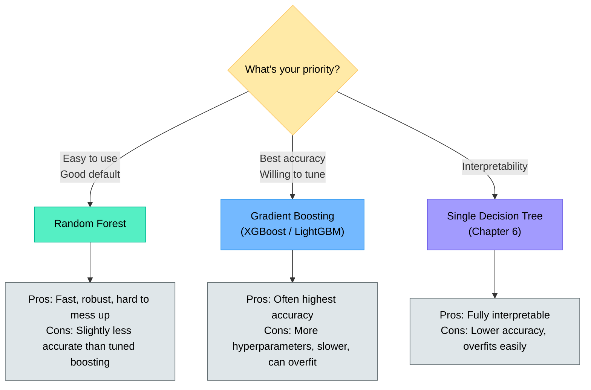
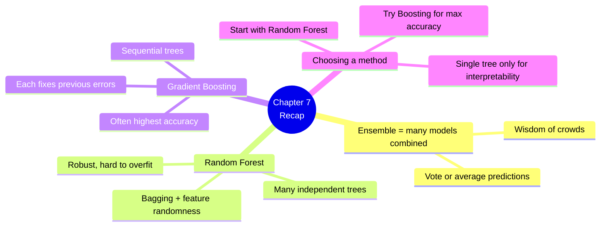

# Chapter 7 — Ensemble Methods: Random Forests and Boosting

> **Learning objectives:** Understand why combining models works, learn how bagging and Random Forests reduce overfitting, get an intuition for boosting, and know when to use each method.

---

## 7.1 The Wisdom of Crowds: Why Combine Models?

A single decision tree is easy to understand but **unstable and often inaccurate**. What if we trained **many trees** and let them **vote**?

This is the core idea behind **ensemble methods**: combine multiple weak models into one strong model.



**Analogy:** Ask 100 people to guess the number of jellybeans in a jar. Individual guesses vary wildly, but the **average** is surprisingly close to the truth. This is ensemble learning.

---

## 7.2 Bagging and Random Forests

### Bagging (Bootstrap Aggregating)

1. Create many **random subsets** of the training data (with replacement — some samples repeated, some left out)
2. Train one decision tree on each subset
3. Combine predictions: **majority vote** (classification) or **average** (regression)



### Random Forest = Bagging + Feature Randomness

A Random Forest adds one more trick: at each split, the tree only considers a **random subset of features** (not all of them). This makes the trees more **diverse**, which improves the ensemble.

| Hyperparameter | Meaning | Typical values |
|:---------------|:--------|:---------------|
| `n_estimators` | Number of trees | 100–500 |
| `max_depth` | Maximum tree depth | 5–20 or None |
| `max_features` | Features considered per split | `"sqrt"` (classification), `"log2"` |

```python
from sklearn.ensemble import RandomForestClassifier

model = RandomForestClassifier(
    n_estimators=200,
    max_depth=10,
    random_state=42
)
model.fit(X_train, y_train)
print(f"Test accuracy: {model.score(X_test, y_test):.3f}")
```

### Why Random Forests work so well

| Single tree problem | How Random Forest fixes it |
|:-------------------|:--------------------------|
| Overfitting | Averaging many trees cancels out noise |
| Instability | Small data changes only affect some trees |
| Low accuracy | Ensemble is more accurate than any single tree |

---

## 7.3 Boosting: Gradient Boosting in a Nutshell

Boosting takes a different approach: instead of training trees **independently**, it trains them **sequentially**, where each new tree focuses on **correcting the mistakes** of the previous ones.



### Key idea

- Each tree is **small** (shallow, e.g., depth 3–5) — called a "weak learner"
- Each new tree learns from the **mistakes** of the combined model so far
- The final prediction is the **sum** of all trees (weighted)

### Gradient Boosting in scikit-learn

```python
from sklearn.ensemble import GradientBoostingClassifier

model = GradientBoostingClassifier(
    n_estimators=100,
    max_depth=3,
    learning_rate=0.1,
    random_state=42
)
model.fit(X_train, y_train)
print(f"Test accuracy: {model.score(X_test, y_test):.3f}")
```

| Hyperparameter | Meaning |
|:---------------|:--------|
| `n_estimators` | Number of boosting rounds (trees) |
| `learning_rate` | How much each tree contributes (smaller = slower but more robust) |
| `max_depth` | Depth of each tree (usually 3–5) |

> **Popular libraries:** XGBoost and LightGBM are faster, optimised versions of gradient boosting used in many competitions and real-world applications.

---

## 7.4 When to Use What



| Method | Speed | Accuracy | Ease of use | Overfitting risk |
|:-------|:------|:---------|:-----------|:----------------|
| Single tree | Fast | Low–Medium | Very easy | High |
| Random Forest | Fast | High | Easy | Low |
| Gradient Boosting | Medium | Very high | Needs tuning | Medium |

---

## 7.5 Hands-On: Random Forest on a Real Dataset

```python
import numpy as np
import matplotlib.pyplot as plt
from sklearn.datasets import load_wine
from sklearn.model_selection import train_test_split
from sklearn.ensemble import RandomForestClassifier, GradientBoostingClassifier
from sklearn.tree import DecisionTreeClassifier
from sklearn.metrics import classification_report

# --- Load and split ---
X, y = load_wine(return_X_y=True)
target_names = load_wine().target_names
X_train, X_test, y_train, y_test = train_test_split(
    X, y, test_size=0.2, random_state=42
)

# --- Compare three models ---
models = {
    "Decision Tree": DecisionTreeClassifier(max_depth=4, random_state=42),
    "Random Forest": RandomForestClassifier(n_estimators=200, random_state=42),
    "Gradient Boosting": GradientBoostingClassifier(n_estimators=100, random_state=42),
}

for name, model in models.items():
    model.fit(X_train, y_train)
    train_acc = model.score(X_train, y_train)
    test_acc = model.score(X_test, y_test)
    print(f"{name:20s}  Train: {train_acc:.3f}  Test: {test_acc:.3f}")

# --- Feature importance (Random Forest) ---
rf = models["Random Forest"]
feature_names = load_wine().feature_names

importances = rf.feature_importances_
indices = np.argsort(importances)[::-1]

plt.figure(figsize=(10, 5))
plt.bar(range(len(importances)), importances[indices])
plt.xticks(range(len(importances)), [feature_names[i] for i in indices], rotation=45, ha="right")
plt.title("Feature Importance (Random Forest)")
plt.ylabel("Importance")
plt.tight_layout()
plt.show()

# --- Effect of number of trees ---
test_scores = []
n_trees_list = [1, 5, 10, 25, 50, 100, 200, 500]
for n in n_trees_list:
    rf = RandomForestClassifier(n_estimators=n, random_state=42)
    rf.fit(X_train, y_train)
    test_scores.append(rf.score(X_test, y_test))

plt.figure(figsize=(8, 4))
plt.plot(n_trees_list, test_scores, "o-")
plt.xlabel("Number of Trees")
plt.ylabel("Test Accuracy")
plt.title("Random Forest: Accuracy vs. Number of Trees")
plt.tight_layout()
plt.show()
```

**What you'll see:**
- Random Forest and Gradient Boosting both outperform the single tree
- Accuracy improves quickly with more trees, then plateaus
- Feature importance reveals which inputs matter most (useful for understanding your data)

---

## Summary



---

## Exercises

1. **Conceptual:** Why does averaging predictions from many trees reduce overfitting compared to a single deep tree?
2. **Bagging:** In a bootstrap sample of 100 drawn from 100 original samples (with replacement), roughly what percentage of original samples will be left out? (Hint: the probability of being left out is $(1 - 1/n)^n$.)
3. **Random Forest vs. Boosting:** Explain in your own words the key difference between how Random Forests and Gradient Boosting build their trees.
4. **Hyperparameter tuning:** You train a Gradient Boosting model with `learning_rate=1.0` and `n_estimators=10`. It overfits. What two changes would you try?
5. **Hands-on:** Train a Random Forest and a Gradient Boosting classifier on the Penguins dataset. Compare their test accuracies and feature importances. Which features are most important for identifying penguin species?
