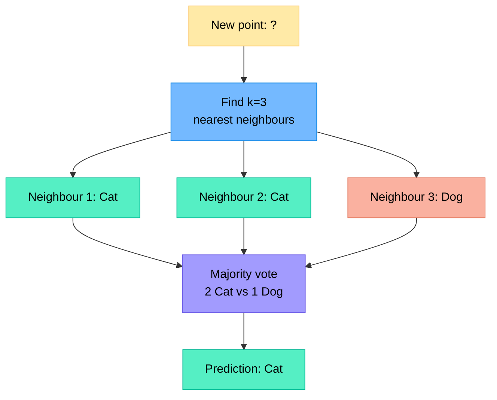
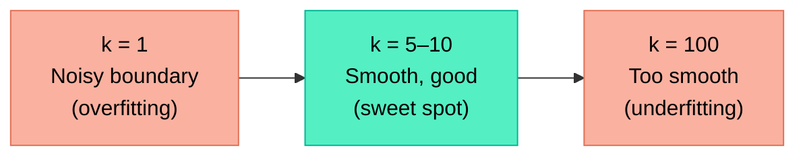
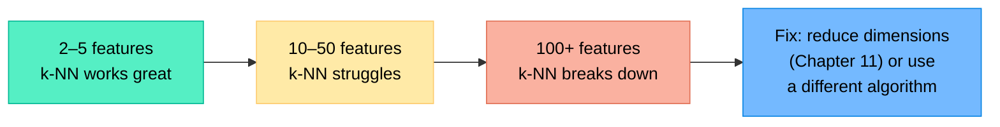
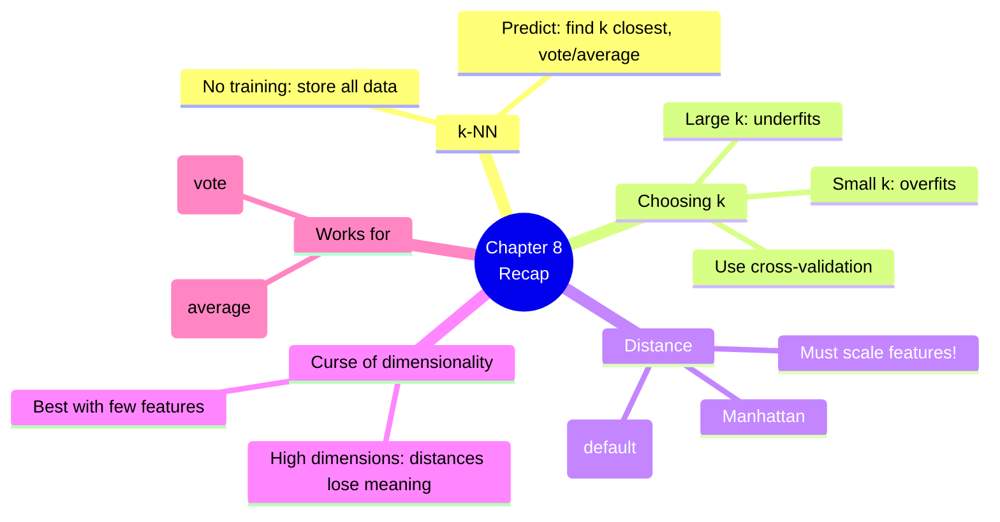

# Chapter 8 — k-Nearest Neighbours (k-NN)

> **Learning objectives:** Understand the simplest ML algorithm, choose the right k and distance metric, grasp the curse of dimensionality, and apply k-NN to classification and regression.

---

## 8.1 The Simplest Idea: Ask Your Neighbours

k-NN has **no training phase**. When asked to predict for a new point, it simply:

1. Finds the **k closest** training points (neighbours)
2. Takes a **vote** (classification) or **average** (regression)



**Analogy:** You just moved to a new city and want to find a good restaurant. You ask the 5 people nearest to you — that's k-NN with k=5.

---

## 8.2 Choosing k and Distance Metrics

### The effect of k

| k value | Behaviour | Risk |
|:--------|:----------|:-----|
| k=1 | Predict the class of the single closest point | **Overfitting** — noisy, unstable |
| k=3–10 | Consider a small neighbourhood | Good balance |
| k=50+ | Very smooth decision boundary | **Underfitting** — ignores local patterns |



> **Tip:** Use **odd values of k** for binary classification to avoid ties. Use cross-validation (Chapter 3) to find the best k.

### Distance metrics

"Closest" needs a definition of **distance**:

| Metric | Formula (2D) | When to use |
|:-------|:-------------|:-----------|
| **Euclidean** | $\sqrt{(x_1 - x_2)^2 + (y_1 - y_2)^2}$ | Default choice, continuous features |
| **Manhattan** | $|x_1 - x_2| + |y_1 - y_2|$ | When features represent grid-like movement |

**Example:** Points A=(1, 2) and B=(4, 6):

$$\text{Euclidean} = \sqrt{(4-1)^2 + (6-2)^2} = \sqrt{9 + 16} = 5$$

$$\text{Manhattan} = |4-1| + |6-2| = 3 + 4 = 7$$

> **Critical:** Features must be **scaled** before using k-NN (Chapter 2). Otherwise, a feature with a large range (e.g., salary: 20,000–200,000) will dominate the distance calculation.

---

## 8.3 The Curse of Dimensionality

k-NN works great with a few features, but struggles as the number of features grows.

### Why?

In high dimensions, **all points become roughly equidistant**. The concept of "nearest neighbour" becomes meaningless.

| Dimensions | Volume needed to capture 10% of data | Intuition |
|:-----------|:-------------------------------------|:----------|
| 1 | 10% of the range | Small |
| 10 | $0.1^{1/10} \approx 80\%$ of each axis | Almost everything |
| 100 | $0.1^{1/100} \approx 98\%$ of each axis | Essentially the whole space |



### Practical takeaway

- k-NN is best with **few, meaningful features**
- If you have many features, consider **dimensionality reduction** (Chapter 11) first
- Or use an algorithm that handles high dimensions better (trees, neural networks)

---

## 8.4 k-NN for Classification and Regression

| Task | How it works | scikit-learn |
|:-----|:------------|:-------------|
| **Classification** | k neighbours vote → majority class wins | `KNeighborsClassifier` |
| **Regression** | k neighbours → average their target values | `KNeighborsRegressor` |

```python
from sklearn.neighbors import KNeighborsClassifier, KNeighborsRegressor

# Classification
clf = KNeighborsClassifier(n_neighbors=5)
clf.fit(X_train, y_train)
print(clf.predict(X_test[:3]))

# Regression
reg = KNeighborsRegressor(n_neighbors=5)
reg.fit(X_train, y_train)
print(reg.predict(X_test[:3]))
```

### Weighted k-NN

Give **closer neighbours more influence**:

```python
clf = KNeighborsClassifier(n_neighbors=5, weights="distance")
```

This helps when the nearest neighbour is much closer than the others.

---

## 8.5 Hands-On: Digit Recognition with k-NN

```python
import numpy as np
import matplotlib.pyplot as plt
from sklearn.datasets import load_digits
from sklearn.model_selection import train_test_split, cross_val_score
from sklearn.neighbors import KNeighborsClassifier
from sklearn.preprocessing import StandardScaler
from sklearn.metrics import classification_report, ConfusionMatrixDisplay

# --- Load the digits dataset ---
digits = load_digits()
X, y = digits.data, digits.target
print(f"Shape: {X.shape}  (8x8 pixel images = 64 features)")
print(f"Classes: {np.unique(y)}")  # 0-9

# --- Visualise some digits ---
fig, axes = plt.subplots(2, 5, figsize=(10, 4))
for ax, img, label in zip(axes.ravel(), digits.images, digits.target):
    ax.imshow(img, cmap="gray")
    ax.set_title(f"Label: {label}")
    ax.axis("off")
plt.suptitle("Sample Digits")
plt.tight_layout()
plt.show()

# --- Scale and split ---
scaler = StandardScaler()
X_scaled = scaler.fit_transform(X)
X_train, X_test, y_train, y_test = train_test_split(
    X_scaled, y, test_size=0.2, random_state=42
)

# --- Find the best k ---
k_values = range(1, 21)
cv_scores = []
for k in k_values:
    model = KNeighborsClassifier(n_neighbors=k)
    scores = cross_val_score(model, X_train, y_train, cv=5, scoring="accuracy")
    cv_scores.append(scores.mean())

plt.figure(figsize=(8, 4))
plt.plot(k_values, cv_scores, "o-")
plt.xlabel("k (number of neighbours)")
plt.ylabel("Cross-Validation Accuracy")
plt.title("Choosing k for k-NN")
plt.tight_layout()
plt.show()

best_k = k_values[np.argmax(cv_scores)]
print(f"Best k: {best_k} (CV accuracy: {max(cv_scores):.3f})")

# --- Train and evaluate with best k ---
model = KNeighborsClassifier(n_neighbors=best_k)
model.fit(X_train, y_train)
y_pred = model.predict(X_test)

print(f"\nTest accuracy: {model.score(X_test, y_test):.3f}")
print("\nClassification Report:")
print(classification_report(y_test, y_pred))

# --- Confusion matrix ---
ConfusionMatrixDisplay.from_predictions(y_test, y_pred)
plt.title(f"k-NN (k={best_k}) — Digit Classification")
plt.tight_layout()
plt.show()

# --- Show some mistakes ---
mistakes = np.where(y_pred != y_test)[0]
if len(mistakes) > 0:
    fig, axes = plt.subplots(1, min(5, len(mistakes)), figsize=(10, 2))
    for ax, idx in zip(np.atleast_1d(axes), mistakes[:5]):
        img = scaler.inverse_transform(X_test[idx].reshape(1, -1)).reshape(8, 8)
        ax.imshow(img, cmap="gray")
        ax.set_title(f"True:{y_test[idx]} Pred:{y_pred[idx]}")
        ax.axis("off")
    plt.suptitle("Misclassified Digits")
    plt.tight_layout()
    plt.show()
```

**Expected results:**
- Accuracy around 97–98% — quite good for such a simple algorithm!
- Best k is typically between 3 and 7
- Most errors are between visually similar digits (e.g., 3/8, 1/7)

---

## Summary



---

## Exercises

1. **By hand:** Given 5 training points in 1D: A(1, Cat), B(2, Dog), C(3, Cat), D(5, Dog), E(6, Dog). A new point is at x=4. What does k-NN predict with k=1? With k=3? With k=5?
2. **Distance:** Compute the Euclidean and Manhattan distances between (2, 5) and (7, 1).
3. **Why scale?** Feature 1 is "age" (range 18–80) and feature 2 is "annual income" (range 20,000–200,000). Without scaling, which feature dominates the distance? What happens to the k-NN predictions?
4. **Curse of dimensionality:** Explain in your own words why k-NN struggles with 1,000 features.
5. **Hands-on:** Apply k-NN to the Iris dataset. Plot test accuracy vs. k (from 1 to 30). What is the optimal k? Compare with the logistic regression result from Chapter 5.
