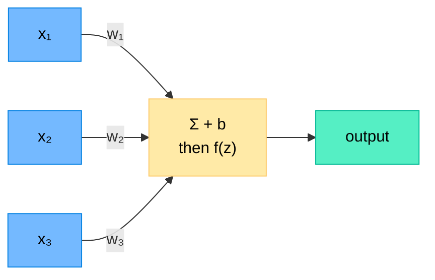
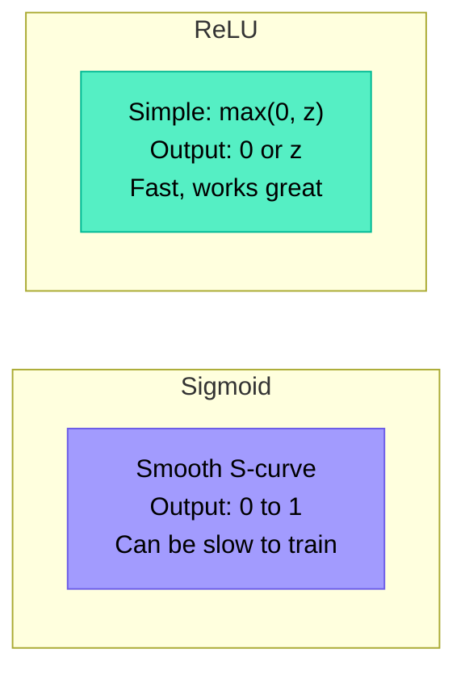
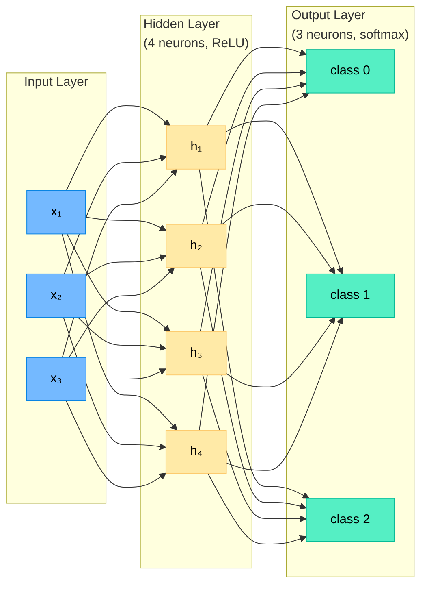
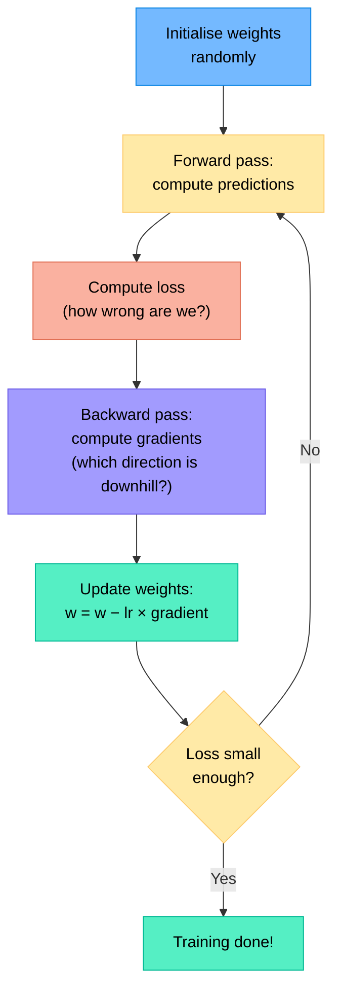
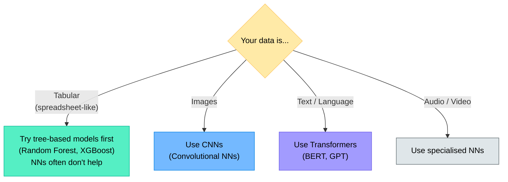

# Chapter 9 — Introduction to Neural Networks

> **Learning objectives:** Understand what a neuron does, learn activation functions, see how layers stack, get the intuition behind gradient descent and backpropagation, and classify handwritten digits with PyTorch.

---

## 9.1 Biological Inspiration (very briefly)

The brain is made of billions of **neurons** connected by synapses. Each neuron receives signals, processes them, and sends a signal to the next neuron.

Artificial neural networks are **loosely inspired** by this: nodes receive inputs, compute a weighted sum, apply a function, and pass the result forward.

> **Important:** Modern neural networks are very different from biological brains. The analogy is helpful for intuition but shouldn't be taken literally.

---

## 9.2 The Perceptron: A Single Neuron

The simplest neural network has just **one neuron**:

$$z = w_1 x_1 + w_2 x_2 + \dots + w_p x_p + b$$

$$\text{output} = f(z)$$

where $f$ is an **activation function**.



This is essentially **logistic regression** (Chapter 5) if $f$ is the sigmoid function!

---

## 9.3 Activation Functions

The activation function introduces **non-linearity** — without it, stacking layers would just be another linear model.

| Function | Formula | Range | Used for |
|:---------|:--------|:------|:---------|
| **Sigmoid** | $\sigma(z) = \frac{1}{1+e^{-z}}$ | (0, 1) | Output layer (binary classification) |
| **ReLU** | $\text{ReLU}(z) = \max(0, z)$ | [0, ∞) | Hidden layers (most popular) |
| **Softmax** | $\frac{e^{z_k}}{\sum_j e^{z_j}}$ | (0, 1), sums to 1 | Output layer (multi-class) |

### Why ReLU is king



- **ReLU** is simple, fast, and works well in practice
- Use it in **hidden layers** by default
- Use **sigmoid** (binary) or **softmax** (multi-class) only in the **output layer**

---

## 9.4 Stacking Layers: The Multi-Layer Perceptron

A single neuron can only learn **linear** boundaries. To learn complex patterns, we stack neurons into **layers**:



| Layer | Role |
|:------|:-----|
| **Input layer** | Receives the raw features (not really a "layer" — just the data) |
| **Hidden layer(s)** | Learn intermediate representations / patterns |
| **Output layer** | Produces the final prediction |

Each arrow has a **weight** (learned during training). More hidden layers = a "deeper" network.

### How many layers and neurons?

| Architecture | Capacity | Typical use |
|:-------------|:---------|:-----------|
| 1 hidden layer, 10–100 neurons | Can learn most simple patterns | Tabular data |
| 2–3 hidden layers | More complex patterns | Medium problems |
| 10+ layers | Very complex patterns | Images, text (deep learning) |

> **Rule of thumb for beginners:** Start with 1–2 hidden layers. Add more only if needed.

---

## 9.5 Training: Gradient Descent and Backpropagation

### The goal

Find the **weights** that minimise the **loss** (error between predictions and true labels).

### Gradient Descent (intuition)

Imagine standing on a hill in the fog. You can't see the bottom, but you can feel the slope under your feet. You take a step **downhill**. Repeat until you reach the lowest point.



### Key terms

| Term | Meaning |
|:-----|:--------|
| **Forward pass** | Push data through the network to get predictions |
| **Loss** | Number measuring how bad the predictions are |
| **Gradient** | The "slope" — tells us how to adjust each weight |
| **Backpropagation** | Algorithm to efficiently compute all gradients by working backwards from the loss |
| **Learning rate (lr)** | Step size — too big: overshoot; too small: very slow |
| **Epoch** | One full pass through all training data |

### The learning rate matters

| Learning rate | What happens |
|:-------------|:------------|
| Too large (e.g., 1.0) | Overshoots, loss jumps around, may never converge |
| Too small (e.g., 0.00001) | Converges very slowly, may get stuck |
| Just right (e.g., 0.001) | Steady decrease in loss, good convergence |

> **Good news:** You don't need to understand the calculus behind backpropagation. PyTorch computes gradients **automatically**.

---

## 9.6 When to Use Neural Networks (and When Not To)



| Situation | Use Neural Networks? |
|:----------|:--------------------|
| Small tabular dataset (< 10,000 rows) | **No** — trees/linear models are better |
| Large tabular dataset | **Maybe** — try trees first |
| Image classification | **Yes** — CNNs are state of the art |
| Text / NLP tasks | **Yes** — Transformers dominate |
| Need interpretability | **No** — use simpler models |
| Very large dataset + complex patterns | **Yes** — NNs shine here |

---

## 9.7 Hands-On: Classifying Handwritten Digits with PyTorch

```python
import torch
import torch.nn as nn
import torch.optim as optim
from torch.utils.data import DataLoader, TensorDataset
from sklearn.datasets import load_digits
from sklearn.model_selection import train_test_split
from sklearn.preprocessing import StandardScaler
import numpy as np
import matplotlib.pyplot as plt

# --- Load and prepare data ---
digits = load_digits()
X, y = digits.data, digits.target

scaler = StandardScaler()
X_scaled = scaler.fit_transform(X)

X_train, X_test, y_train, y_test = train_test_split(
    X_scaled, y, test_size=0.2, random_state=42
)

# Convert to PyTorch tensors
X_train_t = torch.FloatTensor(X_train)
y_train_t = torch.LongTensor(y_train)
X_test_t = torch.FloatTensor(X_test)
y_test_t = torch.LongTensor(y_test)

# Create DataLoader for mini-batches
train_dataset = TensorDataset(X_train_t, y_train_t)
train_loader = DataLoader(train_dataset, batch_size=32, shuffle=True)

# --- Define the network ---
class SimpleNet(nn.Module):
    def __init__(self):
        super().__init__()
        self.network = nn.Sequential(
            nn.Linear(64, 128),   # 64 inputs → 128 hidden neurons
            nn.ReLU(),
            nn.Linear(128, 64),   # 128 → 64 hidden neurons
            nn.ReLU(),
            nn.Linear(64, 10),    # 64 → 10 output classes (digits 0–9)
        )

    def forward(self, x):
        return self.network(x)

model = SimpleNet()
print(model)

# --- Training setup ---
criterion = nn.CrossEntropyLoss()         # loss for multi-class
optimizer = optim.Adam(model.parameters(), lr=0.001)

# --- Training loop ---
n_epochs = 30
train_losses = []

for epoch in range(n_epochs):
    model.train()
    epoch_loss = 0
    for X_batch, y_batch in train_loader:
        # Forward pass
        predictions = model(X_batch)
        loss = criterion(predictions, y_batch)

        # Backward pass
        optimizer.zero_grad()
        loss.backward()
        optimizer.step()

        epoch_loss += loss.item()

    avg_loss = epoch_loss / len(train_loader)
    train_losses.append(avg_loss)

    if (epoch + 1) % 10 == 0:
        print(f"Epoch {epoch+1}/{n_epochs}, Loss: {avg_loss:.4f}")

# --- Plot training loss ---
plt.figure(figsize=(8, 4))
plt.plot(train_losses)
plt.xlabel("Epoch")
plt.ylabel("Loss")
plt.title("Training Loss Over Time")
plt.tight_layout()
plt.show()

# --- Evaluate ---
model.eval()
with torch.no_grad():
    test_preds = model(X_test_t)
    predicted_classes = test_preds.argmax(dim=1)
    accuracy = (predicted_classes == y_test_t).float().mean()
    print(f"\nTest Accuracy: {accuracy:.3f}")

# --- Show some predictions ---
fig, axes = plt.subplots(2, 5, figsize=(12, 5))
for i, ax in enumerate(axes.ravel()):
    img = scaler.inverse_transform(X_test[i].reshape(1, -1)).reshape(8, 8)
    ax.imshow(img, cmap="gray")
    true = y_test[i]
    pred = predicted_classes[i].item()
    colour = "green" if true == pred else "red"
    ax.set_title(f"True:{true} Pred:{pred}", color=colour)
    ax.axis("off")
plt.suptitle("Neural Network Predictions")
plt.tight_layout()
plt.show()
```

**Expected results:**
- Loss decreases steadily over epochs
- Test accuracy around 97–98%
- The model learns without any manual feature engineering — it discovers useful patterns from raw pixels

---

## Summary

```mermaid
mindmap
  root((Chapter 9<br/>Recap))
    Neuron
      Weighted sum + bias
      Activation function
    Activation functions
      ReLU for hidden layers
      Sigmoid/Softmax for output
    Architecture
      Input → Hidden(s) → Output
      More layers = more capacity
    Training
      Forward pass: compute predictions
      Loss: measure error
      Backward pass: compute gradients
      Update weights: gradient descent
    When to use NNs
      Images, text, audio: yes
      Small tabular data: probably not
```

---

## Exercises

1. **Neuron by hand:** A neuron has weights $w_1 = 0.5$, $w_2 = -0.3$, bias $b = 0.1$, and uses ReLU. Compute the output for input $(x_1, x_2) = (2, 4)$.
2. **Activation functions:** Why can't we just use a linear function $f(z) = z$ as the activation? What would happen if we stacked 3 layers with linear activations?
3. **Learning rate:** You're training a network and the loss oscillates wildly (goes up and down). What's likely wrong? What would you change?
4. **Architecture choice:** You have a tabular dataset with 5 features and 200 samples. Would you use a neural network with 10 hidden layers? Why or why not?
5. **Hands-on:** Modify the PyTorch example to use only 1 hidden layer with 32 neurons. Does accuracy change much? Try different learning rates (0.01, 0.001, 0.0001) and plot the training loss curves.
