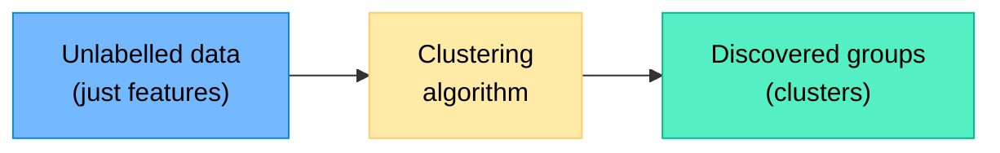
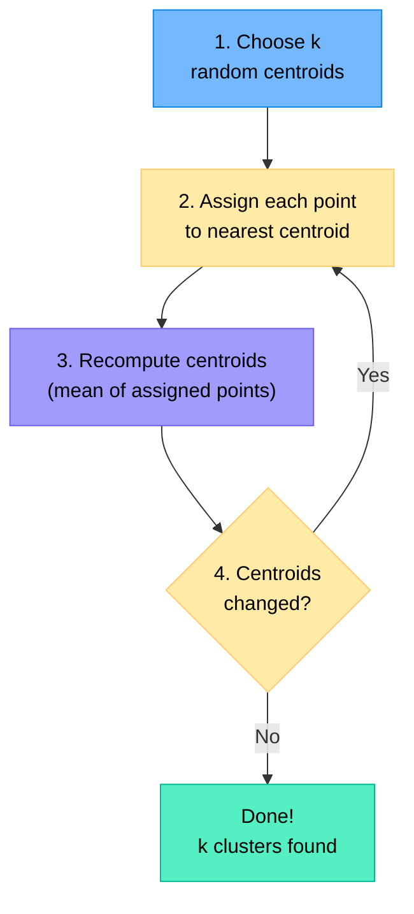
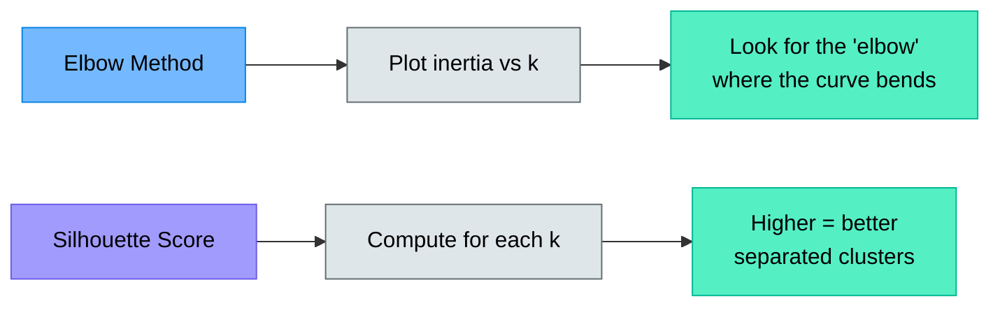
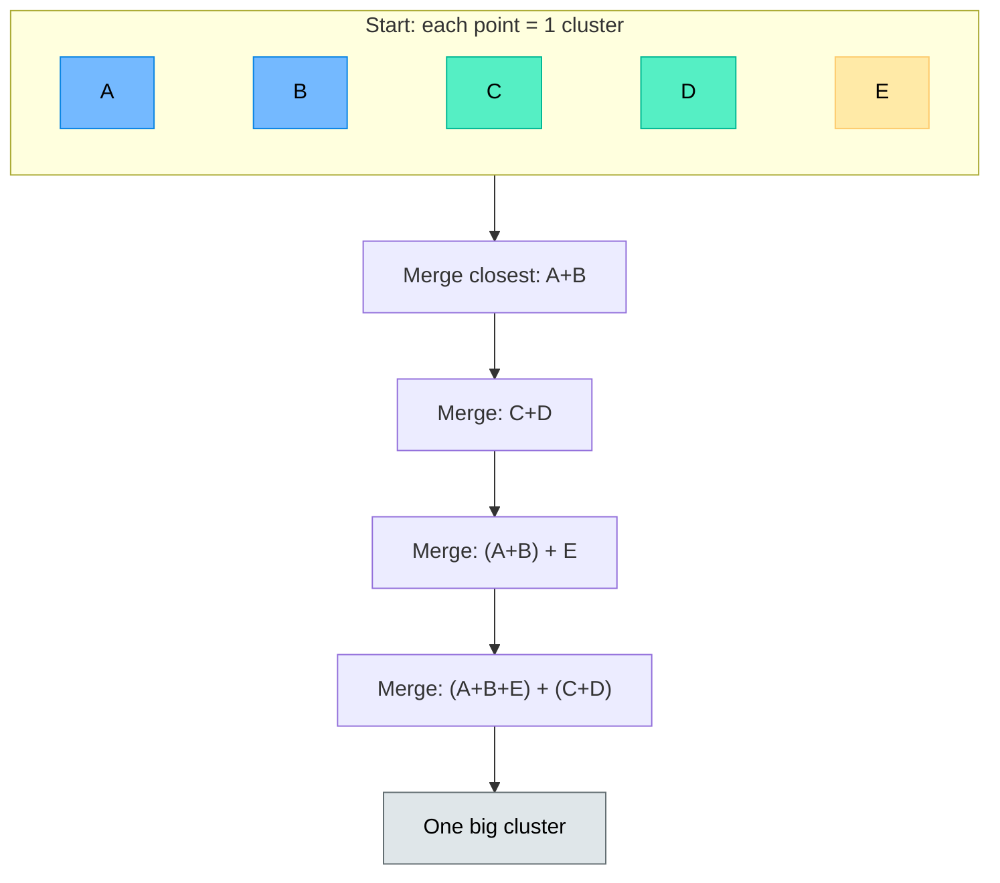
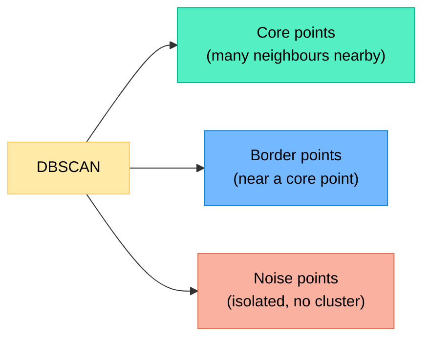
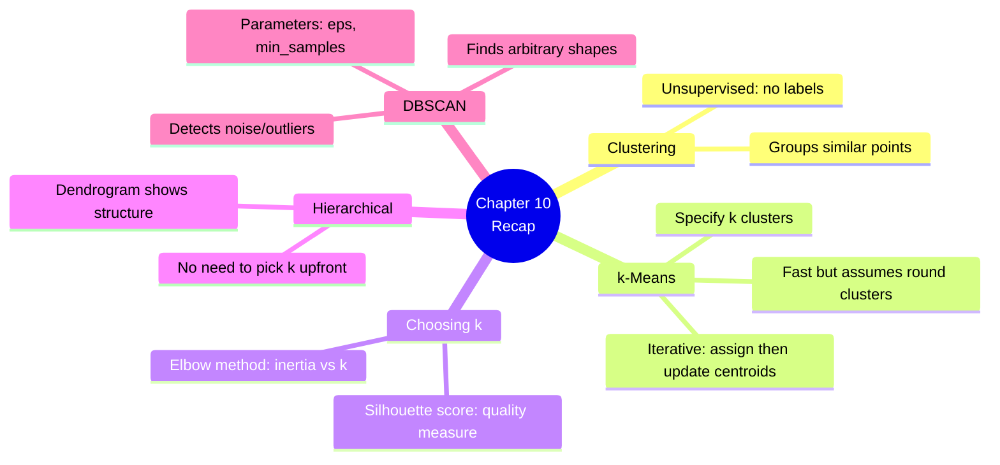

# Chapter 10 — Clustering

> **Learning objectives:** Understand what clustering does, learn k-Means step by step, choose the right number of clusters, discover hierarchical and density-based clustering, and segment customers in a hands-on exercise.

---

## 10.1 What Is Clustering?

Clustering is **unsupervised learning**: there are **no labels**. The algorithm groups similar data points together based solely on their features.



### Real-world examples

| Application | What gets clustered | Why |
|:------------|:-------------------|:----|
| Customer segmentation | Customers by purchase behaviour | Targeted marketing |
| Image compression | Similar pixel colours | Reduce file size |
| Document organisation | Articles by topic | Automatic sorting |
| Anomaly detection | Normal vs. unusual patterns | Fraud, network intrusions |
| Biology | Genes with similar expression | Discover gene functions |

---

## 10.2 k-Means: Algorithm and Intuition

k-Means is the most popular clustering algorithm. You specify **k** (the number of clusters), and the algorithm finds them.

### The algorithm (4 steps, repeated)



### Step-by-step example (k=2, 2D data)

1. **Initialise:** Place 2 centroids randomly
2. **Assign:** Each point goes to the closest centroid → 2 groups
3. **Update:** Move each centroid to the mean position of its group
4. **Repeat** steps 2–3 until the centroids stop moving

```python
from sklearn.cluster import KMeans

kmeans = KMeans(n_clusters=3, random_state=42, n_init=10)
kmeans.fit(X)

labels = kmeans.labels_          # cluster assignment for each point
centroids = kmeans.cluster_centers_  # final centroid positions
```

### Important properties

| Property | k-Means |
|:---------|:--------|
| Must specify k in advance | Yes |
| Cluster shape | Spherical (round) |
| Sensitive to initialisation | Yes (use `n_init=10` to run multiple times) |
| Sensitive to outliers | Yes (outliers pull centroids) |
| Scales to large datasets | Very well |

---

## 10.3 Choosing k

The biggest question: **how many clusters?** Two popular methods:

### The Elbow Method

Plot the **total within-cluster distance** (inertia) for different values of k. Look for the "elbow" — the point where adding more clusters stops helping much.

```python
import matplotlib.pyplot as plt

inertias = []
K_range = range(1, 11)
for k in K_range:
    km = KMeans(n_clusters=k, random_state=42, n_init=10)
    km.fit(X)
    inertias.append(km.inertia_)

plt.figure(figsize=(8, 4))
plt.plot(K_range, inertias, "o-")
plt.xlabel("k (number of clusters)")
plt.ylabel("Inertia (within-cluster distance)")
plt.title("Elbow Method")
plt.tight_layout()
plt.show()
```



### The Silhouette Score

For each point, the silhouette score measures how similar it is to its own cluster vs. the nearest other cluster:

$$s_i = \frac{b_i - a_i}{\max(a_i, b_i)}$$

- $a_i$ = average distance to points in the same cluster
- $b_i$ = average distance to points in the nearest other cluster
- Score ranges from −1 (wrong cluster) to +1 (perfect cluster)

```python
from sklearn.metrics import silhouette_score

for k in range(2, 8):
    km = KMeans(n_clusters=k, random_state=42, n_init=10)
    labels = km.fit_predict(X)
    score = silhouette_score(X, labels)
    print(f"k={k}: Silhouette Score = {score:.3f}")
```

---

## 10.4 Hierarchical Clustering and Dendrograms

Instead of specifying k upfront, **hierarchical clustering** builds a tree of merges:

1. Start with each point as its own cluster
2. Merge the two closest clusters
3. Repeat until everything is in one big cluster
4. Cut the tree at the desired height to get k clusters

### The dendrogram

A **dendrogram** shows the order and distance of merges. You "cut" horizontally to choose the number of clusters.

```python
from scipy.cluster.hierarchy import dendrogram, linkage
import matplotlib.pyplot as plt

# Compute linkage (use Ward's method — minimises variance)
Z = linkage(X, method="ward")

# Plot
plt.figure(figsize=(12, 5))
dendrogram(Z, truncate_mode="lastp", p=20)
plt.xlabel("Cluster")
plt.ylabel("Distance")
plt.title("Hierarchical Clustering Dendrogram")
plt.tight_layout()
plt.show()
```



| Pros | Cons |
|:-----|:-----|
| No need to choose k in advance | Slow for large datasets |
| Dendrogram shows structure at all levels | Cannot undo a merge |
| Works with any distance metric | |

---

## 10.5 A Glimpse at DBSCAN (Density-Based)

k-Means assumes clusters are **round**. What about irregular shapes?

**DBSCAN** (Density-Based Spatial Clustering of Applications with Noise) finds clusters of **arbitrary shape** by looking for dense regions:



| Parameter | Meaning |
|:----------|:--------|
| `eps` | Maximum distance between two points to be neighbours |
| `min_samples` | Minimum points in a neighbourhood to form a dense region |

```python
from sklearn.cluster import DBSCAN

db = DBSCAN(eps=0.5, min_samples=5)
labels = db.fit_predict(X)

n_clusters = len(set(labels)) - (1 if -1 in labels else 0)
n_noise = list(labels).count(-1)
print(f"Clusters: {n_clusters}, Noise points: {n_noise}")
```

| k-Means | DBSCAN |
|:--------|:-------|
| Must specify k | Finds k automatically |
| Spherical clusters | Arbitrary shapes |
| Every point belongs to a cluster | Can label points as noise |
| Sensitive to outliers | Robust to outliers |
| Fast | Can be slow with large eps |

---

## 10.6 Hands-On: Customer Segmentation

```python
import numpy as np
import pandas as pd
import matplotlib.pyplot as plt
from sklearn.cluster import KMeans
from sklearn.preprocessing import StandardScaler
from sklearn.metrics import silhouette_score

# --- Create a synthetic customer dataset ---
np.random.seed(42)
n = 300
data = {
    "annual_income": np.concatenate([
        np.random.normal(30, 5, 100),
        np.random.normal(55, 8, 100),
        np.random.normal(85, 10, 100),
    ]),
    "spending_score": np.concatenate([
        np.random.normal(20, 8, 100),
        np.random.normal(75, 10, 100),
        np.random.normal(45, 12, 100),
    ]),
}
df = pd.DataFrame(data)

# --- Scale ---
scaler = StandardScaler()
X = scaler.fit_transform(df)

# --- Elbow method ---
inertias = []
sil_scores = []
K_range = range(2, 9)

for k in K_range:
    km = KMeans(n_clusters=k, random_state=42, n_init=10)
    labels = km.fit_predict(X)
    inertias.append(km.inertia_)
    sil_scores.append(silhouette_score(X, labels))

fig, (ax1, ax2) = plt.subplots(1, 2, figsize=(12, 4))
ax1.plot(K_range, inertias, "o-")
ax1.set_xlabel("k")
ax1.set_ylabel("Inertia")
ax1.set_title("Elbow Method")

ax2.plot(K_range, sil_scores, "o-")
ax2.set_xlabel("k")
ax2.set_ylabel("Silhouette Score")
ax2.set_title("Silhouette Score")
plt.tight_layout()
plt.show()

# --- Cluster with best k ---
best_k = 3
km = KMeans(n_clusters=best_k, random_state=42, n_init=10)
df["cluster"] = km.fit_predict(X)

# --- Visualise ---
plt.figure(figsize=(8, 6))
for c in range(best_k):
    mask = df["cluster"] == c
    plt.scatter(df.loc[mask, "annual_income"],
                df.loc[mask, "spending_score"],
                label=f"Cluster {c}", alpha=0.6)

# Plot centroids (inverse-scaled)
centroids = scaler.inverse_transform(km.cluster_centers_)
plt.scatter(centroids[:, 0], centroids[:, 1],
            c="black", marker="X", s=200, label="Centroids")

plt.xlabel("Annual Income (k€)")
plt.ylabel("Spending Score")
plt.title("Customer Segmentation (k-Means, k=3)")
plt.legend()
plt.tight_layout()
plt.show()

# --- Describe clusters ---
print("\nCluster profiles:")
print(df.groupby("cluster")[["annual_income", "spending_score"]].mean().round(1))
```

**What you'll see:**
- The elbow/silhouette both suggest k=3
- Three distinct customer segments emerge (e.g., low-income/low-spending, middle-income/high-spending, high-income/moderate-spending)

---

## Summary



---

## Exercises

1. **k-Means by hand:** Given 4 points in 1D: {1, 2, 8, 9}, and initial centroids at 1 and 9, perform one iteration of k-Means (assign, then update centroids).
2. **Choosing k:** The elbow plot shows a clear bend at k=4 but the silhouette score is highest at k=3. What would you do?
3. **k-Means vs. DBSCAN:** You have data shaped like two interleaved half-moons. Which algorithm would work better? Why?
4. **Silhouette:** A point has $a_i = 2$ (average distance to own cluster) and $b_i = 5$ (average distance to nearest other cluster). Compute its silhouette score. Is it well-clustered?
5. **Hands-on:** Load the Penguins dataset, scale the numerical features, and apply k-Means with k=3. Visualise the clusters. Do they match the actual species? Compute the silhouette score.
