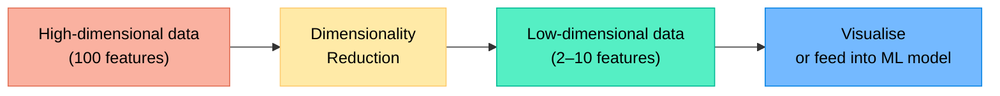
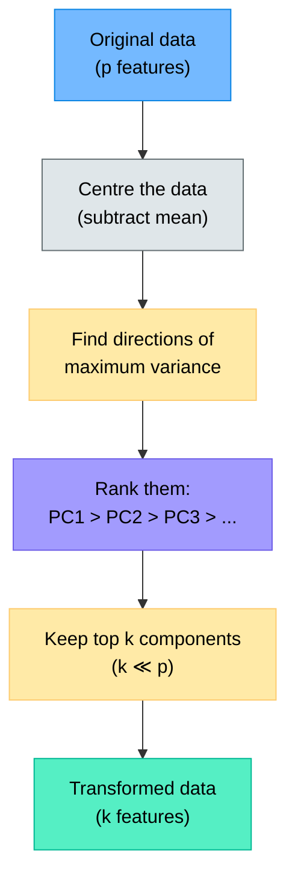
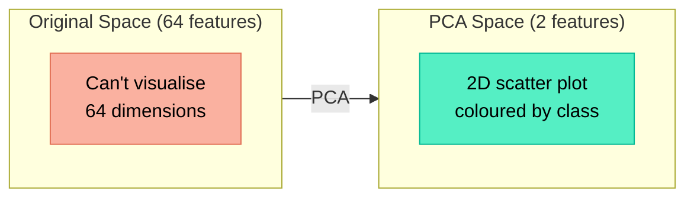
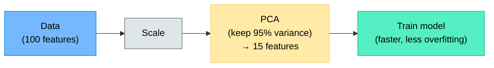
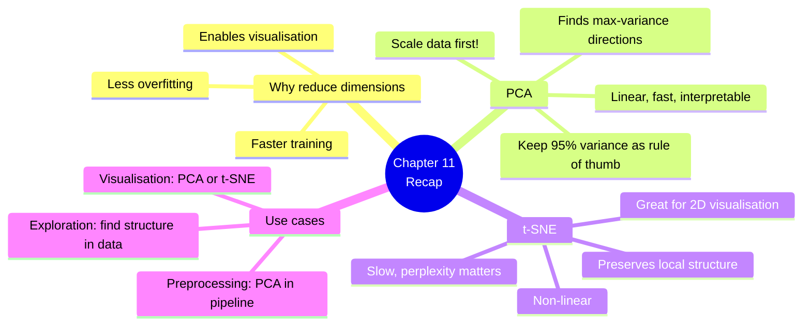

# Chapter 11 — Dimensionality Reduction

> **Learning objectives:** Understand why fewer features can be better, learn Principal Component Analysis (PCA) step by step, visualise high-dimensional data in 2D, get the intuition behind t-SNE, and explore MNIST digits in a hands-on exercise.

---

## 11.1 The Problem: Too Many Features

Imagine a dataset with **hundreds of features**. What can go wrong?

| Problem | Explanation |
|:--------|:-----------|
| **Slow training** | More features = more computation |
| **Overfitting** | Models memorise noise in many dimensions |
| **Hard to visualise** | We can plot 2D or 3D, not 100D |
| **Redundant features** | Many features carry the same information |

**Dimensionality reduction** projects data from many features down to fewer, keeping the important information.



---

## 11.2 Principal Component Analysis (PCA)

PCA is the most common dimensionality reduction technique. It finds new axes (called **principal components**) that capture the **maximum variance** in the data.

### Intuition: finding the best angle

Imagine a cloud of 2D points stretched along a diagonal. PCA rotates the axes so that:

- **PC1** (first principal component) points along the direction of **greatest spread**
- **PC2** points perpendicular to PC1, along the next greatest spread
- And so on for more dimensions



### How much information do we keep?

Each principal component explains a fraction of the total **variance**. We look at the **explained variance ratio**:

$$\text{explained variance ratio}_k = \frac{\text{variance along PC}_k}{\text{total variance}}$$

If PC1 explains 70% and PC2 explains 20%, then just 2 components capture 90% of the information!

### PCA in code

```python
from sklearn.decomposition import PCA
from sklearn.preprocessing import StandardScaler
import matplotlib.pyplot as plt

# Always scale before PCA!
scaler = StandardScaler()
X_scaled = scaler.fit_transform(X)

# Fit PCA — keep all components first to check variance
pca_full = PCA()
pca_full.fit(X_scaled)

# Plot explained variance
plt.figure(figsize=(8, 4))
cumulative = pca_full.explained_variance_ratio_.cumsum()
plt.plot(range(1, len(cumulative) + 1), cumulative, "o-")
plt.axhline(y=0.95, color="red", linestyle="--", label="95% threshold")
plt.xlabel("Number of Components")
plt.ylabel("Cumulative Explained Variance")
plt.title("How Many Components Do We Need?")
plt.legend()
plt.tight_layout()
plt.show()

# Reduce to 2 dimensions
pca = PCA(n_components=2)
X_2d = pca.fit_transform(X_scaled)
print(f"Variance explained by 2 PCs: {pca.explained_variance_ratio_.sum():.1%}")
```

### Key points about PCA

| Point | Detail |
|:------|:-------|
| **Always scale first** | PCA is sensitive to feature scales |
| **Linear method** | Finds straight-line directions |
| **Components are ordered** | PC1 captures the most variance, then PC2, etc. |
| **Components are orthogonal** | Each PC is perpendicular to all others |
| **Data is not lost, just compressed** | You can reconstruct an approximation |

---

## 11.3 Visualising High-Dimensional Data

The most common use of PCA is to **plot data in 2D** when it has many more features:

```python
import matplotlib.pyplot as plt

# After PCA to 2D
plt.figure(figsize=(8, 6))
scatter = plt.scatter(X_2d[:, 0], X_2d[:, 1], c=y, cmap="viridis", alpha=0.6)
plt.colorbar(scatter, label="Class")
plt.xlabel("PC 1")
plt.ylabel("PC 2")
plt.title("Data projected onto first 2 Principal Components")
plt.tight_layout()
plt.show()
```



---

## 11.4 t-SNE: Non-Linear Visualisation

PCA finds **linear** projections. What if the structure of the data is more complex?

**t-SNE** (t-distributed Stochastic Neighbour Embedding) is a non-linear technique designed **specifically for visualisation** in 2D/3D:

| Feature | PCA | t-SNE |
|:--------|:----|:------|
| Type | Linear | Non-linear |
| Main use | General reduction, preprocessing | Visualisation only |
| Preserves | Global structure (large distances) | Local structure (neighbours) |
| Speed | Very fast | Slow for large datasets |
| Reproducible | Yes (deterministic) | Depends on random seed |
| Output dimensions | Any | Usually 2 or 3 |

### t-SNE intuition

- Points that are **close** in high-dimensional space should stay **close** in 2D
- Points that are **far** can end up anywhere
- t-SNE is great at revealing **clusters** but doesn't preserve distances between clusters

```python
from sklearn.manifold import TSNE

tsne = TSNE(n_components=2, random_state=42, perplexity=30)
X_tsne = tsne.fit_transform(X_scaled)

plt.figure(figsize=(8, 6))
scatter = plt.scatter(X_tsne[:, 0], X_tsne[:, 1], c=y, cmap="viridis", alpha=0.6)
plt.colorbar(scatter, label="Class")
plt.xlabel("t-SNE 1")
plt.ylabel("t-SNE 2")
plt.title("t-SNE Visualisation")
plt.tight_layout()
plt.show()
```

### The perplexity parameter

| Perplexity | Effect |
|:-----------|:-------|
| Low (5–10) | Very tight, small clusters; may miss global structure |
| Medium (30) | Good default — balanced local/global |
| High (50–100) | Broader structure; clusters may merge |

> **Warning:** Don't read too much into the distances or sizes of t-SNE clusters. Only the **groupings** (which points are together) are meaningful.

---

## 11.5 PCA for Preprocessing (Not Just Visualisation)

PCA isn't only for plotting. It can also **speed up** and **improve** other models:



```python
from sklearn.decomposition import PCA
from sklearn.pipeline import Pipeline
from sklearn.ensemble import RandomForestClassifier

pipe = Pipeline([
    ("scaler", StandardScaler()),
    ("pca", PCA(n_components=0.95)),   # keep 95% of variance
    ("clf", RandomForestClassifier(random_state=42)),
])

pipe.fit(X_train, y_train)
print(f"Reduced to {pipe['pca'].n_components_} components")
print(f"Accuracy: {pipe.score(X_test, y_test):.3f}")
```

---

## 11.6 Hands-On: Visualising MNIST Digits

```python
import numpy as np
import matplotlib.pyplot as plt
from sklearn.datasets import load_digits
from sklearn.preprocessing import StandardScaler
from sklearn.decomposition import PCA
from sklearn.manifold import TSNE

# --- Load data ---
digits = load_digits()
X, y = digits.data, digits.target
print(f"Shape: {X.shape}  (each image is 8×8 = 64 features)")

# --- Show some digits ---
fig, axes = plt.subplots(2, 5, figsize=(10, 4))
for i, ax in enumerate(axes.ravel()):
    ax.imshow(digits.images[i], cmap="gray")
    ax.set_title(f"Label: {y[i]}")
    ax.axis("off")
plt.suptitle("Sample Digits (8×8 pixels)")
plt.tight_layout()
plt.show()

# --- Scale ---
scaler = StandardScaler()
X_scaled = scaler.fit_transform(X)

# --- PCA: explained variance ---
pca_full = PCA()
pca_full.fit(X_scaled)

plt.figure(figsize=(8, 4))
cumulative = pca_full.explained_variance_ratio_.cumsum()
plt.plot(range(1, len(cumulative) + 1), cumulative, "o-", markersize=3)
plt.axhline(y=0.95, color="red", linestyle="--", label="95% variance")
plt.xlabel("Number of Components")
plt.ylabel("Cumulative Explained Variance")
plt.title("PCA: How Many Components for 95%?")
plt.legend()
plt.tight_layout()
plt.show()

n_95 = (cumulative >= 0.95).argmax() + 1
print(f"\nComponents needed for 95% variance: {n_95}")

# --- PCA 2D ---
pca = PCA(n_components=2)
X_pca = pca.fit_transform(X_scaled)

plt.figure(figsize=(8, 6))
scatter = plt.scatter(X_pca[:, 0], X_pca[:, 1], c=y, cmap="tab10",
                      alpha=0.5, s=10)
plt.colorbar(scatter, label="Digit")
plt.xlabel("PC 1")
plt.ylabel("PC 2")
plt.title(f"PCA 2D ({pca.explained_variance_ratio_.sum():.1%} variance)")
plt.tight_layout()
plt.show()

# --- t-SNE 2D ---
tsne = TSNE(n_components=2, random_state=42, perplexity=30)
X_tsne = tsne.fit_transform(X_scaled)

plt.figure(figsize=(8, 6))
scatter = plt.scatter(X_tsne[:, 0], X_tsne[:, 1], c=y, cmap="tab10",
                      alpha=0.5, s=10)
plt.colorbar(scatter, label="Digit")
plt.xlabel("t-SNE 1")
plt.ylabel("t-SNE 2")
plt.title("t-SNE 2D Visualisation")
plt.tight_layout()
plt.show()
```

**What you'll see:**
- ~95% of variance is captured by roughly 25–30 components (out of 64)
- PCA 2D shows some separation but digit clusters overlap
- t-SNE 2D reveals **clear, well-separated clusters** for each digit — much better for visualisation

---

## Summary



---

## Exercises

1. **PCA intuition:** You have 2D data where all points lie exactly on a straight line. How many principal components carry useful information? What would PC2 look like?
2. **Variance explained:** A PCA gives explained variance ratios [0.52, 0.25, 0.12, 0.06, 0.03, 0.02]. How many components do you need for 90% of the variance?
3. **Scaling:** Why must you standardise features before PCA? What happens if one feature is in metres and another in kilometres?
4. **PCA vs. t-SNE:** You want to reduce 50 features to 10 as a preprocessing step before training a classifier. Would you use PCA or t-SNE? Why?
5. **Hands-on:** Load the Wine dataset, apply PCA to reduce to 2D, and colour points by class. Then do the same with t-SNE. Compare the two plots — which shows clearer separation?
