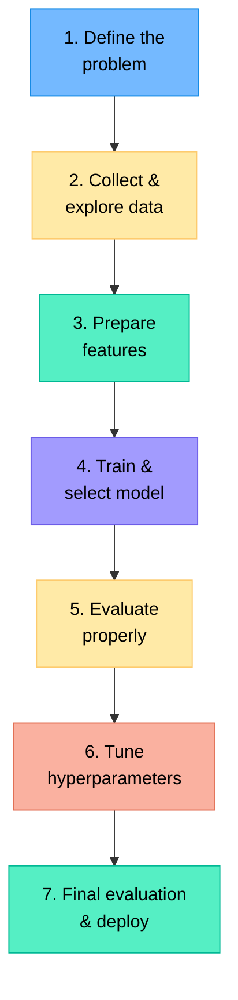
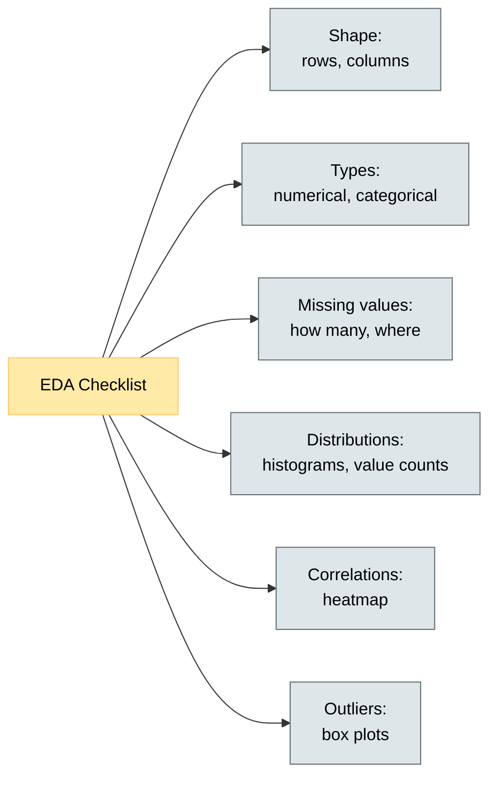
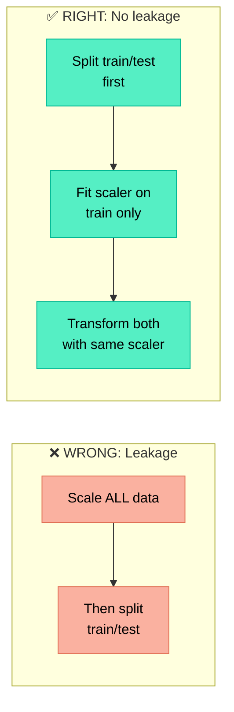
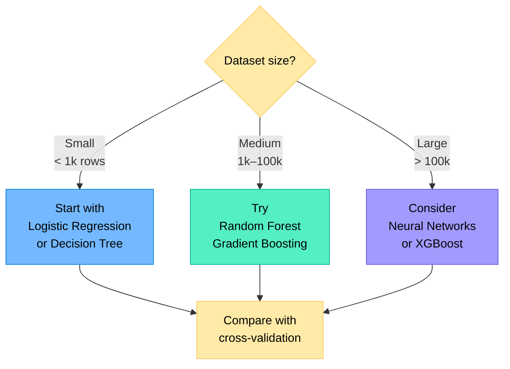
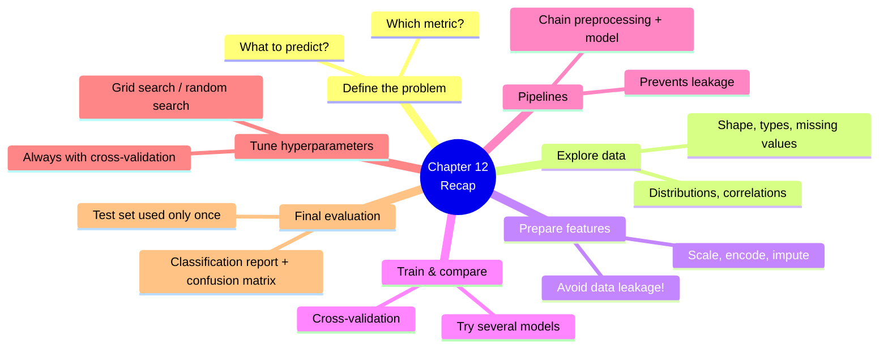

# Chapter 12 — The Complete ML Pipeline

> **Learning objectives:** See how all the pieces fit together, learn a structured workflow from problem definition to deployment, understand feature engineering basics, use scikit-learn `Pipeline`, tune hyperparameters with grid search, and build an end-to-end mini-project.

---

## 12.1 The Big Picture

Every ML project follows the same high-level workflow. This chapter ties together everything from Chapters 1–11.



---

## 12.2 Step 1 — Define the Problem

Before touching any data, answer these questions:

| Question | Example answer |
|:---------|:--------------|
| What am I predicting? | Whether a customer will churn (yes/no) |
| Is this classification or regression? | Binary classification |
| What metric matters? | Recall (we don't want to miss churners) |
| What data do I have? | Customer demographics, usage history |
| What would a human do? | Look at usage drop-off, complaints |

> **Tip:** If you can't clearly state what you're predicting and how you'll measure success, you're not ready to code.

---

## 12.3 Step 2 — Explore the Data (EDA)

A quick checklist for **Exploratory Data Analysis**:



```python
import pandas as pd
import seaborn as sns
import matplotlib.pyplot as plt

df = pd.read_csv("data.csv")

# Quick overview
print(df.shape)
print(df.dtypes)
print(df.describe())
print(df.isnull().sum())

# Distributions
df.hist(figsize=(12, 8), bins=30)
plt.tight_layout()
plt.show()

# Correlation heatmap
plt.figure(figsize=(10, 8))
sns.heatmap(df.select_dtypes("number").corr(), annot=True, cmap="coolwarm", fmt=".2f")
plt.title("Feature Correlations")
plt.tight_layout()
plt.show()
```

---

## 12.4 Step 3 — Prepare Features (Feature Engineering)

Feature engineering transforms raw data into something the model can learn from effectively.

### Common techniques

| Technique | When to use | Example |
|:----------|:-----------|:--------|
| **Imputation** | Missing values | Fill NaN with median |
| **Encoding** | Categorical features | One-hot encode "colour" |
| **Scaling** | Numerical features | StandardScaler for k-NN, SVM, NNs |
| **Creating features** | Domain knowledge | `total_spend = quantity × price` |
| **Binning** | Continuous → categories | Age → "young", "middle", "senior" |
| **Log transform** | Skewed distributions | `log(income)` |

### Feature engineering DO's and DON'Ts

| DO | DON'T |
|:---|:------|
| Scale features for distance-based models | Scale the target variable (usually) |
| Encode categorical variables | Feed raw strings to models |
| Create features from domain knowledge | Create hundreds of random features |
| Handle missing values | Drop rows unless truly unavoidable |
| Fit transformers on training data only | Fit on the entire dataset (data leakage!) |

### Data leakage: the #1 beginner mistake



---

## 12.5 Step 4 — Train and Select a Model

Try several models and compare them with **cross-validation**:

```python
from sklearn.model_selection import cross_val_score
from sklearn.linear_model import LogisticRegression
from sklearn.ensemble import RandomForestClassifier, GradientBoostingClassifier
from sklearn.neighbors import KNeighborsClassifier

models = {
    "Logistic Regression": LogisticRegression(max_iter=1000),
    "Random Forest": RandomForestClassifier(random_state=42),
    "Gradient Boosting": GradientBoostingClassifier(random_state=42),
    "k-NN": KNeighborsClassifier(),
}

for name, model in models.items():
    scores = cross_val_score(model, X_train, y_train, cv=5, scoring="f1")
    print(f"{name:25s}  F1 = {scores.mean():.3f} ± {scores.std():.3f}")
```

### Model selection guide



---

## 12.6 Step 5 — Scikit-Learn Pipelines

A **Pipeline** chains preprocessing and model into a single object. This prevents data leakage and makes code cleaner.

```python
from sklearn.pipeline import Pipeline
from sklearn.preprocessing import StandardScaler
from sklearn.ensemble import RandomForestClassifier

pipe = Pipeline([
    ("scaler", StandardScaler()),
    ("model", RandomForestClassifier(random_state=42)),
])

# Cross-validate the entire pipeline — no leakage!
scores = cross_val_score(pipe, X_train, y_train, cv=5, scoring="f1")
print(f"Pipeline F1 = {scores.mean():.3f} ± {scores.std():.3f}")
```

### Pipelines with mixed feature types

```python
from sklearn.compose import ColumnTransformer
from sklearn.preprocessing import StandardScaler, OneHotEncoder
from sklearn.impute import SimpleImputer
from sklearn.pipeline import Pipeline
from sklearn.ensemble import GradientBoostingClassifier

numerical_features = ["age", "income", "usage_hours"]
categorical_features = ["plan_type", "region"]

num_pipeline = Pipeline([
    ("imputer", SimpleImputer(strategy="median")),
    ("scaler", StandardScaler()),
])

cat_pipeline = Pipeline([
    ("imputer", SimpleImputer(strategy="most_frequent")),
    ("encoder", OneHotEncoder(handle_unknown="ignore")),
])

preprocessor = ColumnTransformer([
    ("num", num_pipeline, numerical_features),
    ("cat", cat_pipeline, categorical_features),
])

full_pipeline = Pipeline([
    ("preprocess", preprocessor),
    ("model", GradientBoostingClassifier(random_state=42)),
])

full_pipeline.fit(X_train, y_train)
print(f"Accuracy: {full_pipeline.score(X_test, y_test):.3f}")
```

---

## 12.7 Step 6 — Hyperparameter Tuning

Models have settings (**hyperparameters**) that are not learned from data. We search for the best ones.

| Method | How it works | Pros | Cons |
|:-------|:------------|:-----|:-----|
| **Grid Search** | Try all combinations | Thorough | Slow if many parameters |
| **Random Search** | Sample random combos | Faster | May miss optimal |

```python
from sklearn.model_selection import GridSearchCV

param_grid = {
    "model__n_estimators": [100, 200, 300],
    "model__max_depth": [3, 5, 10, None],
    "model__min_samples_split": [2, 5],
}

grid = GridSearchCV(
    full_pipeline,
    param_grid,
    cv=5,
    scoring="f1",
    n_jobs=-1,
    verbose=1,
)
grid.fit(X_train, y_train)

print(f"Best params: {grid.best_params_}")
print(f"Best CV F1:  {grid.best_score_:.3f}")
```

> **Note:** `model__` prefix is needed because the hyperparameter belongs to the `"model"` step of the pipeline.

---

## 12.8 Step 7 — Final Evaluation

Once you've chosen your model and tuned hyperparameters, evaluate **once** on the held-out test set:

```python
from sklearn.metrics import classification_report, confusion_matrix
import seaborn as sns

best_model = grid.best_estimator_
y_pred = best_model.predict(X_test)

print(classification_report(y_test, y_pred))

cm = confusion_matrix(y_test, y_pred)
sns.heatmap(cm, annot=True, fmt="d", cmap="Blues")
plt.xlabel("Predicted")
plt.ylabel("Actual")
plt.title("Confusion Matrix — Test Set")
plt.tight_layout()
plt.show()
```

> **Never tune hyperparameters on the test set.** It should only be used **once**, at the very end.

---

## 12.9 End-to-End Mini-Project: Wine Quality

```python
import pandas as pd
import numpy as np
import matplotlib.pyplot as plt
import seaborn as sns
from sklearn.datasets import load_wine
from sklearn.model_selection import train_test_split, cross_val_score, GridSearchCV
from sklearn.preprocessing import StandardScaler
from sklearn.pipeline import Pipeline
from sklearn.linear_model import LogisticRegression
from sklearn.ensemble import RandomForestClassifier, GradientBoostingClassifier
from sklearn.neighbors import KNeighborsClassifier
from sklearn.metrics import classification_report, confusion_matrix

# ========================================
# 1. Load and explore
# ========================================
wine = load_wine()
df = pd.DataFrame(wine.data, columns=wine.feature_names)
df["target"] = wine.target

print(f"Shape: {df.shape}")
print(f"Classes: {np.unique(wine.target)} ({np.bincount(wine.target)})")
print(df.describe().round(2))

# ========================================
# 2. Split
# ========================================
X = df.drop("target", axis=1)
y = df["target"]
X_train, X_test, y_train, y_test = train_test_split(
    X, y, test_size=0.2, random_state=42, stratify=y
)

# ========================================
# 3. Compare models with pipelines
# ========================================
pipelines = {
    "Logistic Regression": Pipeline([
        ("scaler", StandardScaler()),
        ("model", LogisticRegression(max_iter=2000)),
    ]),
    "Random Forest": Pipeline([
        ("scaler", StandardScaler()),
        ("model", RandomForestClassifier(random_state=42)),
    ]),
    "Gradient Boosting": Pipeline([
        ("scaler", StandardScaler()),
        ("model", GradientBoostingClassifier(random_state=42)),
    ]),
    "k-NN": Pipeline([
        ("scaler", StandardScaler()),
        ("model", KNeighborsClassifier()),
    ]),
}

print("\n--- Cross-Validation Results ---")
results = {}
for name, pipe in pipelines.items():
    scores = cross_val_score(pipe, X_train, y_train, cv=5, scoring="accuracy")
    results[name] = scores
    print(f"{name:25s}  Acc = {scores.mean():.3f} ± {scores.std():.3f}")

# ========================================
# 4. Tune the best model
# ========================================
param_grid = {
    "model__n_estimators": [100, 200, 300],
    "model__max_depth": [3, 5, 10, None],
    "model__learning_rate": [0.05, 0.1, 0.2],
}

grid = GridSearchCV(
    pipelines["Gradient Boosting"],
    param_grid,
    cv=5,
    scoring="accuracy",
    n_jobs=-1,
)
grid.fit(X_train, y_train)

print(f"\nBest params: {grid.best_params_}")
print(f"Best CV Accuracy: {grid.best_score_:.3f}")

# ========================================
# 5. Final evaluation on test set
# ========================================
best = grid.best_estimator_
y_pred = best.predict(X_test)

print("\n--- Test Set Results ---")
print(classification_report(y_test, y_pred, target_names=wine.target_names))

# Confusion matrix
fig, ax = plt.subplots(figsize=(6, 5))
cm = confusion_matrix(y_test, y_pred)
sns.heatmap(cm, annot=True, fmt="d", cmap="Blues",
            xticklabels=wine.target_names, yticklabels=wine.target_names, ax=ax)
ax.set_xlabel("Predicted")
ax.set_ylabel("Actual")
ax.set_title("Final Confusion Matrix")
plt.tight_layout()
plt.show()

print("\n✅ Pipeline complete!")
```

---

## Summary



---

## Exercises

1. **Data leakage:** Explain why fitting a scaler on the entire dataset before splitting introduces data leakage. What information leaks from the test set?
2. **Pipeline:** Write a scikit-learn `Pipeline` that: (a) imputes missing values with the median, (b) scales features, and (c) trains a Random Forest.
3. **Hyperparameter tuning:** You have a Random Forest in a pipeline. Write a `GridSearchCV` that searches over `n_estimators` ∈ {100, 200} and `max_depth` ∈ {5, 10, None}.
4. **Metric choice:** Your model predicts whether a patient has a rare disease (1% of cases). Why is accuracy a bad metric? What should you use instead?
5. **Hands-on:** Take the Penguins dataset, build a full pipeline (handle missing values, encode species as target, scale numerical features, encode categorical features), compare at least 3 models, tune the best one, and report final test performance.
