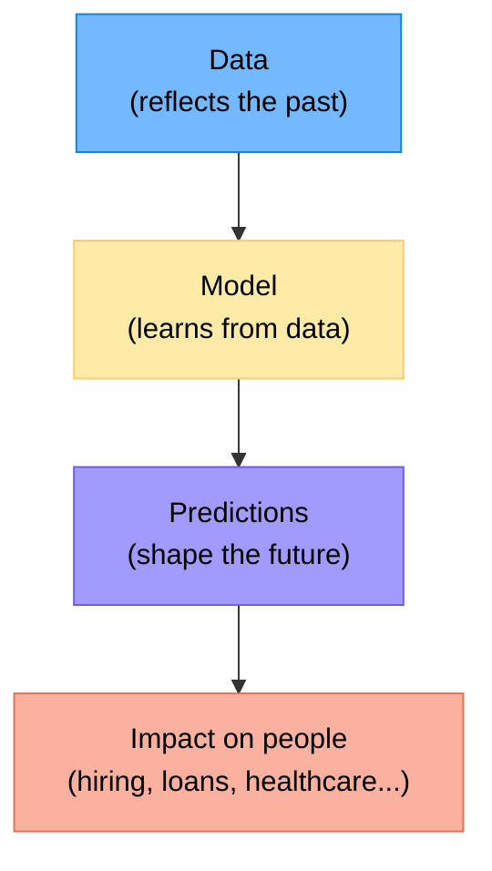
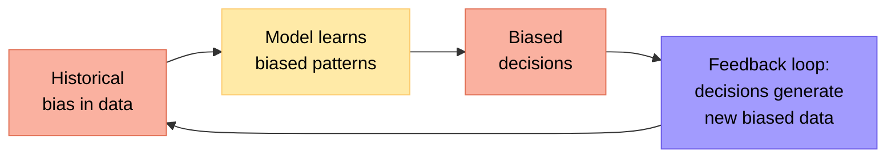
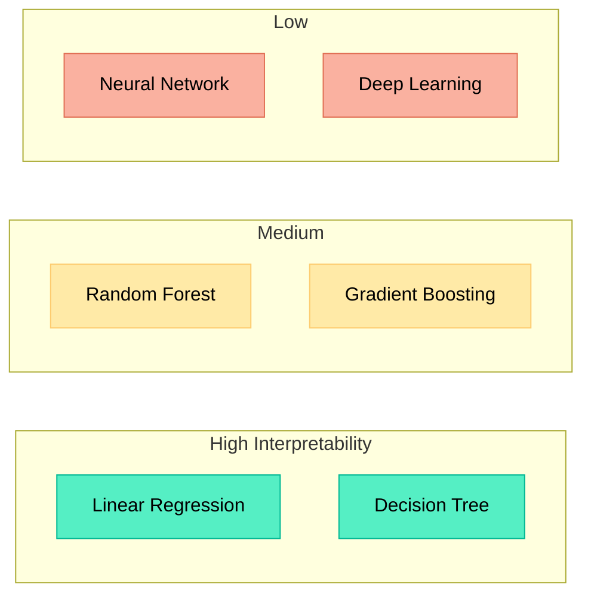
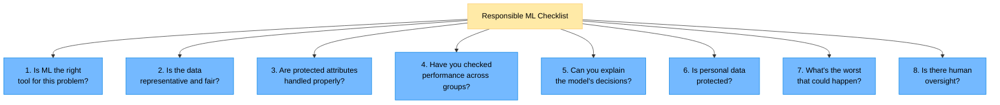
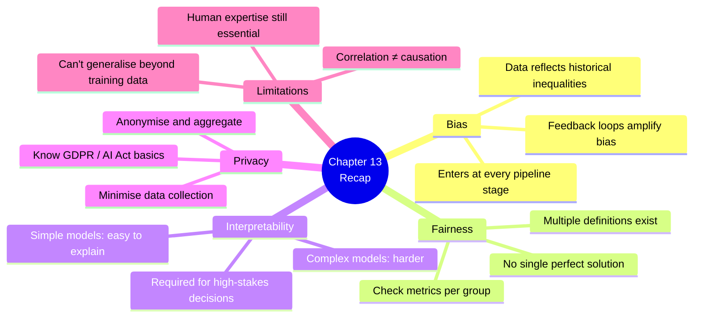

# Chapter 13 — Ethics and Limitations of Machine Learning

> **Learning objectives:** Understand how bias enters ML systems, see a fairness example, learn about interpretability, know the basics of data privacy, and use a responsible ML checklist.

---

## 13.1 Why Ethics Matters in ML

ML models make decisions that **affect people**: who gets a loan, who gets flagged for extra security screening, what news you see. If the model is biased or wrong, real people are harmed.



> **Key insight:** ML doesn't create bias — it **amplifies** bias already present in the data.

---

## 13.2 How Bias Gets Into Models

Bias can enter at **every stage** of the ML pipeline:

| Stage | How bias enters | Example |
|:------|:---------------|:--------|
| **Data collection** | Some groups are under-represented | Medical dataset with mostly male patients |
| **Labelling** | Human labellers have biases | Résumés labelled "good" reflect historical preferences |
| **Feature choice** | Proxies for protected attributes | Postcode as a proxy for ethnicity |
| **Model training** | Optimises for majority patterns | High accuracy overall but terrible for minorities |
| **Evaluation** | Wrong metric hides problems | 95% accuracy but 30% recall for one group |
| **Deployment** | Feedback loops reinforce bias | Predictive policing → more patrols → more arrests → "confirms" prediction |



---

## 13.3 Fairness: A Concrete Example

### The hiring model

A company trains a model to screen CVs. Training data: the last 10 years of hiring decisions.

| Problem | What happens |
|:--------|:------------|
| Historical data reflects past discrimination | Model learns to prefer profiles similar to past hires |
| Gender-correlated features | "Women's chess club" penalised; "rugby captain" rewarded |
| Result | Model systematically ranks women lower |

### Types of fairness

| Fairness criterion | Definition (simplified) |
|:-------------------|:-----------------------|
| **Demographic parity** | Equal acceptance rate across groups |
| **Equal opportunity** | Equal true positive rate across groups |
| **Individual fairness** | Similar individuals get similar predictions |

> **There is no single "correct" definition of fairness.** Different situations call for different criteria, and some fairness definitions are mathematically incompatible.

### Checking for bias in code

```python
import pandas as pd

# Assume df has predictions and a "group" column
for group in df["group"].unique():
    mask = df["group"] == group
    acceptance_rate = df.loc[mask, "prediction"].mean()
    print(f"Group '{group}': acceptance rate = {acceptance_rate:.2%}")
```

---

## 13.4 Interpretability: Can You Explain the Decision?

| Model type | Interpretability | Example |
|:-----------|:----------------|:--------|
| Linear / Logistic Regression | **High** — coefficients tell you feature importance | "Income increases approval by 0.3" |
| Decision Tree | **High** — you can read the rules | "If income > 50k AND debt < 10k → approve" |
| Random Forest | **Medium** — feature importance, but individual trees complex | Top features: income, debt ratio |
| Neural Network | **Low** — millions of parameters, hard to explain | "The model says no" (but why?) |



### Why interpretability matters

- **Healthcare:** A doctor needs to understand why the model predicts cancer
- **Finance:** Regulations require explainable credit decisions
- **Trust:** Users are more likely to trust a model they can understand
- **Debugging:** You can spot errors in interpretable models

### Simple tools for interpretability

```python
# Feature importance from a Random Forest
import matplotlib.pyplot as plt

importances = model.feature_importances_
features = X.columns

plt.figure(figsize=(8, 5))
plt.barh(features, importances)
plt.xlabel("Importance")
plt.title("Feature Importance")
plt.tight_layout()
plt.show()
```

---

## 13.5 Privacy Basics

ML models learn from data — and that data often contains **personal information**.

| Risk | Description |
|:-----|:-----------|
| **Data exposure** | Training data may contain names, addresses, health records |
| **Model memorisation** | Large models can memorise and regurgitate individual records |
| **Membership inference** | An attacker can determine if a person was in the training set |
| **Re-identification** | "Anonymised" data can sometimes be linked back to individuals |

### Basic protections

| Protection | How it helps |
|:-----------|:------------|
| **Minimise data** | Only collect what you actually need |
| **Anonymise** | Remove direct identifiers (name, ID) |
| **Aggregate** | Use group-level statistics instead of individual records |
| **Access control** | Limit who can access the data |
| **Differential privacy** | Add mathematical noise to protect individuals |

### Regulations you should know about

| Regulation | Region | Key idea |
|:-----------|:-------|:---------|
| **GDPR** | EU | Right to explanation, right to be forgotten, consent |
| **CCPA** | California | Right to know, right to delete |
| **AI Act** | EU | Risk-based classification of AI systems |

---

## 13.6 What ML Cannot Do

It's just as important to know the **limitations** as the capabilities:

| Limitation | Explanation |
|:----------|:-----------|
| **Can't reason causally** | Correlation ≠ causation; ML finds patterns, not causes |
| **Can't generalise beyond training data** | Model fails on data very different from what it's seen |
| **Can't handle rare events well** | Not enough examples to learn from |
| **Can't replace domain expertise** | You still need humans to define the problem and validate results |
| **Can't guarantee fairness automatically** | Must be actively checked and enforced |
| **Can't explain itself (always)** | Complex models are often black boxes |

---

## 13.7 Responsible ML Checklist

Use this checklist for every ML project:



| # | Question | What to do |
|:--|:---------|:-----------|
| 1 | Is ML the right tool? | Consider if simple rules would work |
| 2 | Is data representative? | Check class balance and demographic coverage |
| 3 | Protected attributes? | Don't use race, gender, religion directly; watch for proxies |
| 4 | Performance across groups? | Report metrics per subgroup, not just overall |
| 5 | Explainability? | Use interpretable models for high-stakes decisions |
| 6 | Privacy? | Follow data minimisation; comply with regulations |
| 7 | Worst case? | Think about failure modes and their impact |
| 8 | Human oversight? | Keep humans in the loop for critical decisions |

---

## Summary



---

## Exercises

1. **Bias identification:** A bank trains a loan approval model on 10 years of historical decisions. Name three ways bias could enter this system.
2. **Fairness trade-off:** Your model has 90% accuracy overall, but 95% for Group A and 70% for Group B. Is the model fair? What would you do?
3. **Proxy features:** A hiring model doesn't use gender directly, but uses "years of maternity leave" as a feature. Is this fair? Why or why not?
4. **Interpretability choice:** A hospital wants to predict patient risk. Should they use a neural network or a logistic regression? Justify your answer.
5. **Responsible checklist:** Pick any ML application (e.g., facial recognition, content recommendation, predictive policing) and go through the 8-question checklist. Document your answers for each question.
