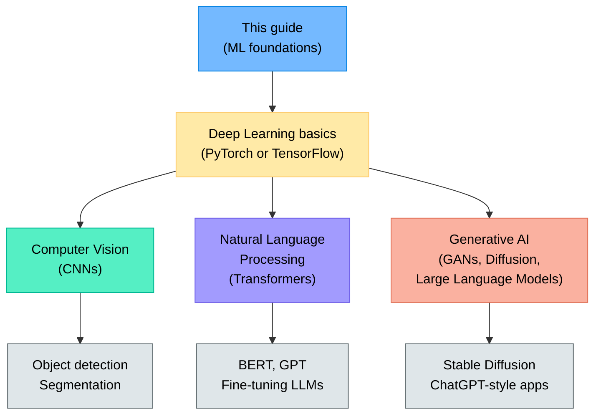
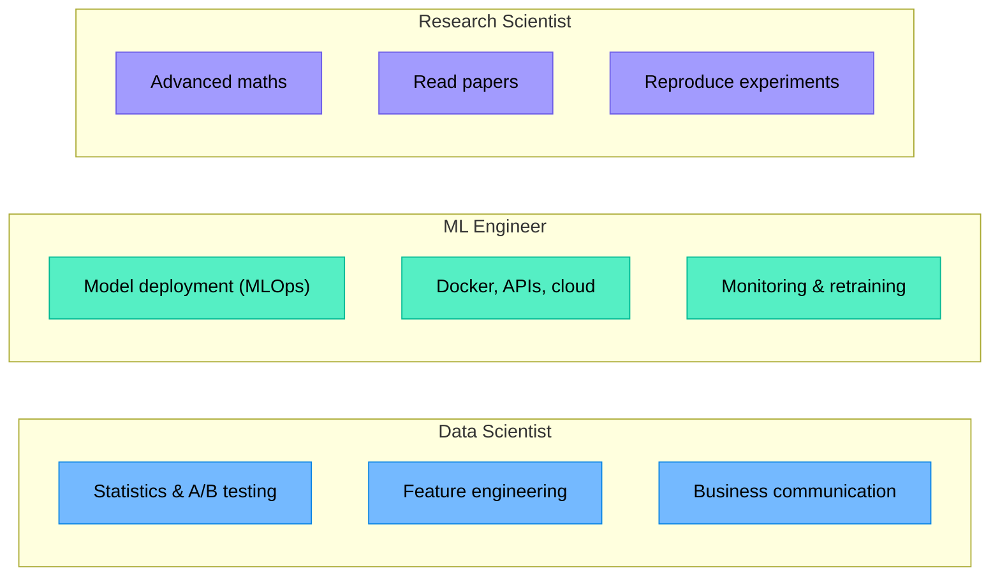

# Appendix E — What to Learn Next

> **You've completed the foundations!** Here's a roadmap for going further — from intermediate topics to advanced specialisations.

---

## E.1 Immediate Next Steps

These topics build directly on what you've learned:

| Topic | What it adds | Where to start |
|:------|:------------|:---------------|
| **Regularisation** (Ridge, Lasso, Elastic Net) | Prevents overfitting in linear models by penalising large weights | scikit-learn docs → Linear Models |
| **Support Vector Machines (SVM)** | Powerful classifier that finds the maximum-margin boundary | scikit-learn docs → SVM |
| **XGBoost / LightGBM** | Industry-standard gradient boosting libraries, faster and more flexible | XGBoost documentation |
| **Feature selection** | Choosing the most informative features systematically | scikit-learn → Feature selection |
| **Handling imbalanced data** | SMOTE, class weights, under/oversampling | imbalanced-learn library |

---

## E.2 Deep Learning Path

If you want to work with images, text, or audio:

---

## E.3 MSc-Level Study Guide

For a more comprehensive and mathematically rigorous treatment of all topics in this guide — plus advanced chapters on SVMs, regularisation, Bayesian methods, time series, and reinforcement learning — see the companion guide:

> **Machine Learning — A Comprehensive Study Guide** (MSc level)
>
> Located in: `machine-learning-msc-course/`

---

## E.4 Recommended Books

| Book | Level | Focus |
|:-----|:------|:------|
| *Hands-On Machine Learning with Scikit-Learn, Keras, and TensorFlow* (Aurélien Géron) | Beginner–Intermediate | Practical ML and deep learning |
| *An Introduction to Statistical Learning* (James, Witten, Hastie, Tibshirani) | Beginner–Intermediate | Theory with R/Python labs (free PDF) |
| *Deep Learning with Python* (François Chollet) | Intermediate | Keras/TensorFlow deep learning |
| *The Hundred-Page Machine Learning Book* (Andriy Burkov) | Beginner | Concise overview |
| *Pattern Recognition and Machine Learning* (Christopher Bishop) | Advanced | Mathematical foundations |

---

## E.5 Online Courses

| Course | Platform | Notes |
|:-------|:---------|:------|
| **Machine Learning** (Andrew Ng) | Coursera | The classic intro course |
| **Deep Learning Specialisation** (Andrew Ng) | Coursera | 5-course deep learning series |
| **Fast.ai — Practical Deep Learning** | fast.ai | Top-down, code-first approach |
| **CS229: Machine Learning** | Stanford (YouTube) | University-level theory |
| **CS231n: CNNs for Visual Recognition** | Stanford (YouTube) | Computer vision |
| **CS224n: NLP with Deep Learning** | Stanford (YouTube) | Natural language processing |
| **Kaggle Learn** | kaggle.com | Short, hands-on micro-courses |

---

## E.6 Practice Platforms

| Platform | What you'll do |
|:---------|:--------------|
| **Kaggle** | Competitions, datasets, notebooks, community |
| **Google Colab** | Free GPU notebooks for experiments |
| **HuggingFace** | Pre-trained models, datasets, Transformers library |
| **UCI ML Repository** | Classic benchmark datasets |
| **Papers With Code** | Find state-of-the-art methods with implementations |

---

## E.7 Topics by Career Interest

---

## E.8 A Suggested 3-Month Plan

| Month | Focus | Activities |
|:------|:------|:-----------|
| **1** | Solidify foundations | Re-do all hands-on exercises; complete 2 Kaggle "Getting Started" competitions |
| **2** | Go deeper | Learn XGBoost; study regularisation; read ISLR chapters 5–8; start a Kaggle tabular competition |
| **3** | Explore deep learning | Take Fast.ai Part 1; build an image classifier; fine-tune a pre-trained model |

---

> **Remember:** The best way to learn ML is to **practise with real data**. Pick a dataset that interests you, define a question, and build a model end to end. You already have all the tools — go build something!
