# Machine Learning Foundations

<div class="pt-8">
  <span class="text-orange-400 font-bold text-xl">BSc Course — First Year</span>
</div>

<div class="pt-6 text-left inline-block">
  <p class="text-sm text-gray-300">From data to models — a practical introduction</p>
</div>

<div class="abs-br m-6 text-sm text-gray-400">
  2026
</div>

---

# Agenda

<div class="grid grid-cols-2 gap-4 mt-2 text-sm leading-tight">

<div class="space-y-1">

### Part I — Foundations
1. **What Is Machine Learning?**
2. **Working with Data**
3. **How Do We Know a Model Is Good?**

### Part II — Supervised Learning
4. **Linear Regression**
5. **Logistic Regression & Classification**
6. **Decision Trees**
7. **Ensemble Methods**
8. **k-Nearest Neighbours**
9. **Introduction to Neural Networks**

</div>

<div class="space-y-1">

### Part III — Unsupervised Learning
10. **Clustering**
11. **Dimensionality Reduction**

### Part IV — Putting It All Together
12. **The Complete ML Pipeline**
13. **Ethics & Limitations**

### Appendices
A. Python & NumPy Crash Course · B. Math You Need · C. Notation · D. Glossary · E. What to Learn Next

</div>

</div>

---
layout: section
---

# Part I
## Foundations

---

# What Is Machine Learning?

<div class="grid grid-cols-2 gap-4 mt-2 text-sm leading-tight">

<div class="space-y-1">

### Definition

A program **learns from data** instead of being explicitly programmed with rules.

> *"A program learns from experience E w.r.t. task T and measure P, if its performance on T improves with E."* — Tom Mitchell

### You already use ML every day

Email spam filter · Netflix recommendations · Voice assistants · Auto-correct · Google Photos face recognition · GPS traffic prediction

</div>

<div class="space-y-1">

<div>

### Traditional Programming vs ML

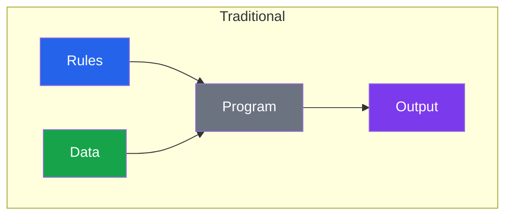
</div>

<div>
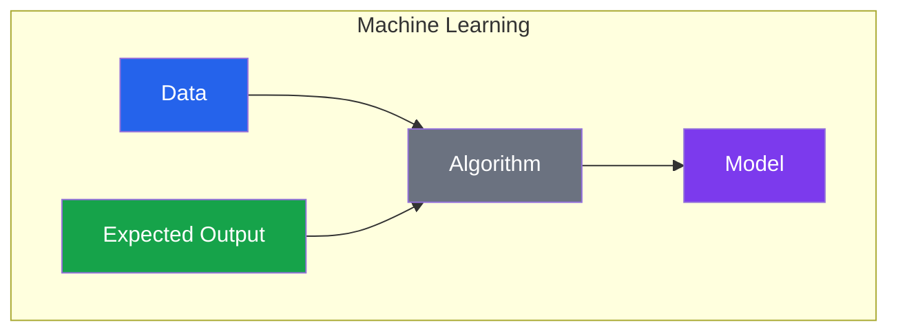
</div>

</div>

</div>

---

# Three Types of Machine Learning

<div class="grid grid-cols-3 gap-4 mt-4 text-sm">

<div class="border border-purple-400 rounded-lg p-3">

### Supervised Learning
**Has labels ✅**

The dataset has inputs AND correct answers.

- **Classification** — predict a category (spam/not spam)
- **Regression** — predict a number (house price)

</div>

<div class="border border-orange-400 rounded-lg p-3">

### Unsupervised Learning
**No labels ❌**

The model discovers hidden structure.

- **Clustering** — group similar items
- **Dimensionality reduction** — compress data

</div>

<div class="border border-blue-400 rounded-lg p-3">

### Reinforcement Learning
**Reward signal 🎯**

An agent takes actions and receives rewards or penalties.

- Game-playing AI
- Robotics
- Self-driving cars

</div>

</div>

---

# The ML Workflow

<div class="mt-1">

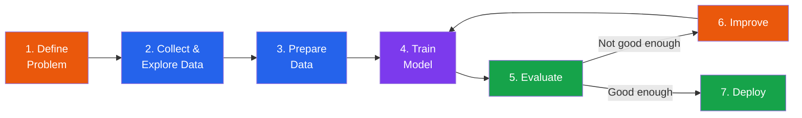

</div>

<div class="grid grid-cols-2 gap-4 mt-2 text-sm leading-tight">

<div class="space-y-1">

### ML works well when
- **Enough data** (hundreds to millions)
- **Real pattern** to learn (not random noise)
- **Well-defined** task (clear input → output)
- Too **complex** for hand-written rules

</div>

<div class="space-y-1">

### ML does NOT work well when
- Very **little data** available
- Problem solvable with a **simple formula**
- **100% correctness** required
- Data is **biased** or unrepresentative

</div>

</div>

---

# Working with Data

<div class="grid grid-cols-2 gap-4 mt-2 text-sm leading-tight">

<div class="space-y-1">

### What is a dataset?

A **table** where each row = one sample, each column = one feature, and one special column = the **target**.

| House | Size (m²) | Rooms | City | Price (€) |
|:------|:----------|:------|:-----|:----------|
| 1 | 85 | 2 | Lyon | 210k |
| 2 | 120 | 3 | Paris | 450k |
| 3 | 60 | 1 | Marseille | 140k |

### Feature types

**Numerical** — continuous (temperature) or discrete (rooms)

**Categorical** — nominal (colour, city) or ordinal (low/med/high)

</div>

<div class="space-y-1">

### Encoding categorical features

| Method | When | Example |
|:-------|:-----|:--------|
| **One-hot** | Nominal (no order) | Red → [1,0,0] |
| **Label** | Ordinal (ordered) | Low=0, Med=1, High=2 |

### Feature scaling

| Method | Formula | Range |
|:-------|:--------|:------|
| **Min-max** | $(x - \min) / (\max - \min)$ | [0, 1] |
| **Standardisation** | $(x - \bar{x}) / \sigma$ | ~[−3, 3] |

**Always scale** for distance-based models (k-NN, SVM, NNs)

</div>

</div>

---

# Train / Validation / Test Split

<div class="grid grid-cols-2 gap-16 mt-2 text-sm leading-tight">

<div class="mt-1">

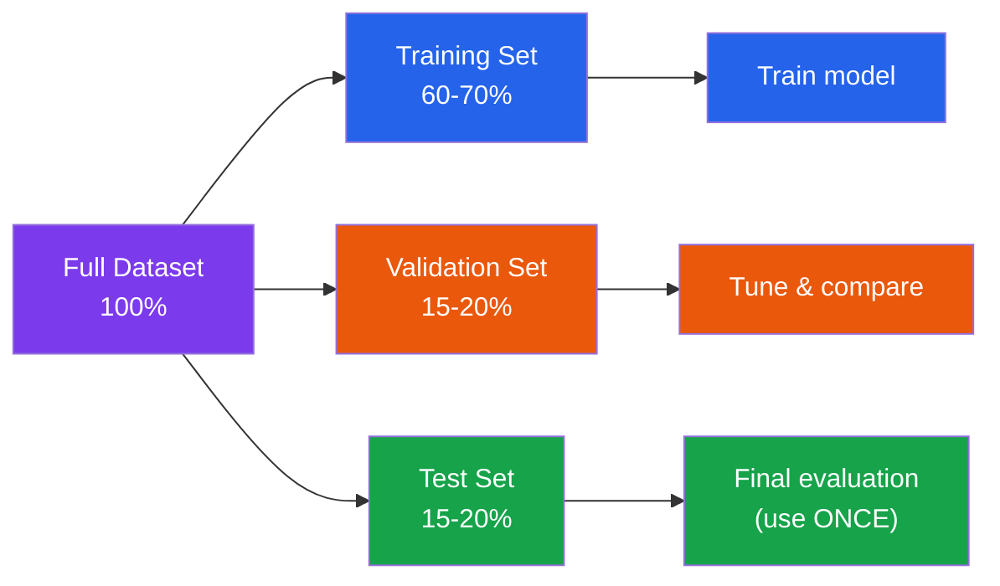

</div>


<div class="space-y-1">

### Why split?

- **Training set** — model learns parameters
- **Validation set** — tune hyperparameters, compare models
- **Test set** — final, unbiased performance estimate


### Handling missing data

- **Drop rows** — only if very few are missing
- **Fill with median/mode** — safe default
- **Flag as missing** — add a binary column

### Detecting outliers

Use the **IQR method**: anything below $Q1 - 1.5 \times IQR$ or above $Q3 + 1.5 \times IQR$

</div>

</div>

---

# How Do We Know a Model Is Good?

<div class="grid grid-cols-2 gap-4 mt-2 text-xs leading-tight">

<div class="space-y-1">

#### Overfitting vs Underfitting

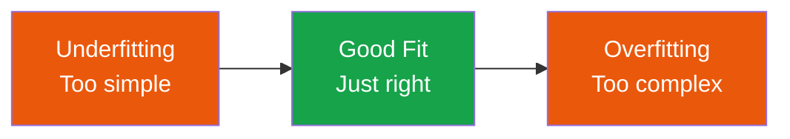

| | Underfitting | Good fit | Overfitting |
|:--|:--|:--|:--|
| Train | Poor | Good | Excellent |
| Test | Poor | Good | Poor |
| Fix | More complex model | — | Simplify, more data |

#### k-Fold Cross-Validation

Split data into k folds → train on k−1, validate on 1 → repeat k times → average scores. Gives robust estimates.

</div>

<div class="space-y-1">

#### Classification Metrics

| Metric | What it measures |
|:-------|:----------------|
| **Accuracy** | Fraction correct (misleading if imbalanced) |
| **Precision** | $TP / (TP + FP)$ — of predicted +, how many are truly + |
| **Recall** | $TP / (TP + FN)$ — of actual +, how many did we catch |
| **F1 Score** | Harmonic mean of Precision & Recall |

#### Regression Metrics

| Metric | Formula |
|:-------|:--------|
| **MAE** | $\frac{1}{n}\sum\|y_i - \hat{y}_i\|$ |
| **MSE** | $\frac{1}{n}\sum(y_i - \hat{y}_i)^2$ |
| **RMSE** | $\sqrt{MSE}$ |
| **R²** | 1 − SS_res / SS_tot |

</div>

</div>

---

# The Confusion Matrix

<div class="grid grid-cols-2 gap-4 mt-2 text-sm leading-tight">

<div class="space-y-1">

### Binary Confusion Matrix

|  | Predicted + | Predicted − |
|:--|:--|:--|
| **Actual +** | TP ✅ | FN ❌ |
| **Actual −** | FP ❌ | TN ✅ |

**Precision** = TP / (TP + FP) — "When I say positive, am I right?"

**Recall** = TP / (TP + FN) — "Did I catch all positives?"

</div>

<div class="space-y-1">

### When to prioritise which?

| Scenario | Prioritise |
|:---------|:----------|
| Spam filter | **Precision** — don't lose good emails |
| Cancer screening | **Recall** — don't miss any patients |
| Balanced need | **F1 score** |


</div>

</div>

---
layout: section
---

# Part II
## Supervised Learning

---

# Linear Regression

<div class="grid grid-cols-2 gap-4 mt-2 text-sm leading-tight">

<div class="space-y-1">

### Fitting a Line

Predict a continuous number: $\hat{y} = w \cdot x + b$

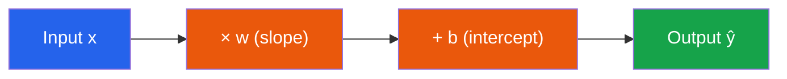

| Symbol | Meaning |
|:-------|:--------|
| $w$ | Weight (slope) |
| $b$ | Bias (intercept) |
| $\hat{y}$ | Predicted value |

**Example:** $w=3000, b=50000$
80 m² house → $3000 \times 80 + 50000 = 290{,}000$ €

</div>

<div class="space-y-1">

### Cost function: MSE

$$\text{MSE} = \frac{1}{n} \sum_{i=1}^{n} (y_i - \hat{y}_i)^2$$

Find $w, b$ that **minimise** MSE.

### Multiple features

$$\hat{y} = w_1 x_1 + w_2 x_2 + \dots + w_p x_p + b$$

Each weight = impact of that feature on the prediction.

### Limitations

- Assumes a **linear** relationship
- Sensitive to **outliers**
- Struggles with **multicollinearity**

</div>

</div>

---

# Logistic Regression & Classification

<div class="grid grid-cols-2 gap-4 mt-2 text-sm leading-tight">

<div class="space-y-1">

### From numbers to probabilities

Linear regression outputs −∞ to +∞. We need [0, 1].

**Sigmoid function:** $\sigma(z) = \frac{1}{1 + e^{-z}}$

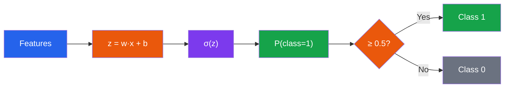

### Decision boundary

Where $\sigma(z) = 0.5$, i.e. $z = 0$: a straight line separating classes.

</div>

<div class="space-y-1">

### Loss: Binary Cross-Entropy

$$L = -\frac{1}{n}\sum[y_i\log(\hat{p}_i) + (1-y_i)\log(1-\hat{p}_i)]$$

Penalises confident wrong predictions heavily.

### Multi-class extensions

| Method | How it works |
|:-------|:------------|
| **One-vs-Rest** | Train k binary classifiers |
| **Softmax** | Generalise sigmoid to k classes, outputs sum to 1 |

### When to use

- **Binary** classification baseline
- Need **probability** outputs
- Features are roughly **linearly separable**
- Need **interpretable** coefficients

</div>

</div>

---

# Decision Trees

<div class="grid grid-cols-2 gap-4 mt-2 text-sm leading-tight">

<div class="space-y-1">

### A flowchart for decisions

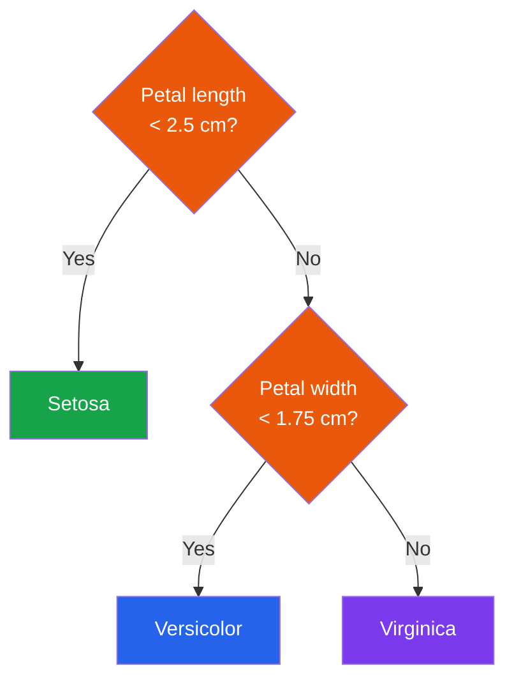

### Tree anatomy

Root node → Internal nodes (questions) → Branches (yes/no) → Leaf nodes (predictions)

The tree **automatically selects** the best features and thresholds.

</div>

<div class="space-y-1 text-xs leading-tight">

### How splits are chosen

**Gini Impurity:** $\text{Gini} = 1 - \sum p_k^2$

| Gini | Meaning |
|:-----|:--------|
| 0 | Pure node (one class) |
| 0.5 | Maximum mix (binary) |

Pick the split with **highest information gain** (largest Gini reduction).

### Overfitting & Pruning

Unpruned trees memorise training data. Solutions:

| Param | Effect |
|:------|:-------|
| `max_depth` | Limit tree depth |
| `min_samples_split` | Min samples to split |
| `min_samples_leaf` | Min samples in leaf |

**Strengths:** Interpretable · handles mixed features · no scaling needed

**Weaknesses:** Overfits easily · unstable (small data changes → different tree)

</div>

</div>

---

# Ensemble Methods

<div class="mt-1">

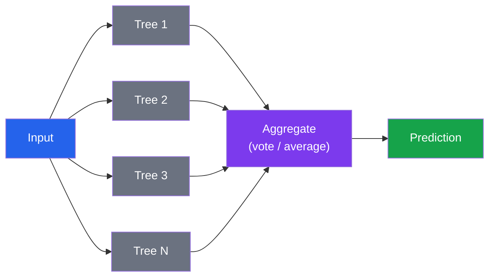

</div>

<div class="grid grid-cols-2 gap-4 mt-2 text-xs leading-tight">

<div class="space-y-1">

### Random Forest (Bagging)

1. Create **bootstrap samples** (random subsets with replacement)
2. Train one tree per sample
3. At each split, use **random feature subset**
4. Combine: **majority vote** or **average**

**Key:** Trees are diverse → errors cancel out

</div>

<div class="space-y-1">

### Gradient Boosting

1. Train a weak tree on the data
2. Compute **errors** (residuals)
3. Train next tree **on the errors**
4. Repeat: each tree corrects the previous

| Method | Training | Strength |
|:-------|:---------|:---------|
| **Random Forest** | Parallel | Robust, hard to overfit |
| **Gradient Boosting** | Sequential | Often higher accuracy |

</div>

</div>

---

# k-Nearest Neighbours (k-NN)

<div class="grid grid-cols-2 gap-4 mt-2 text-sm leading-tight">

<div class="space-y-1">

### The simplest algorithm

**No training!** To predict, find the k closest points and vote.

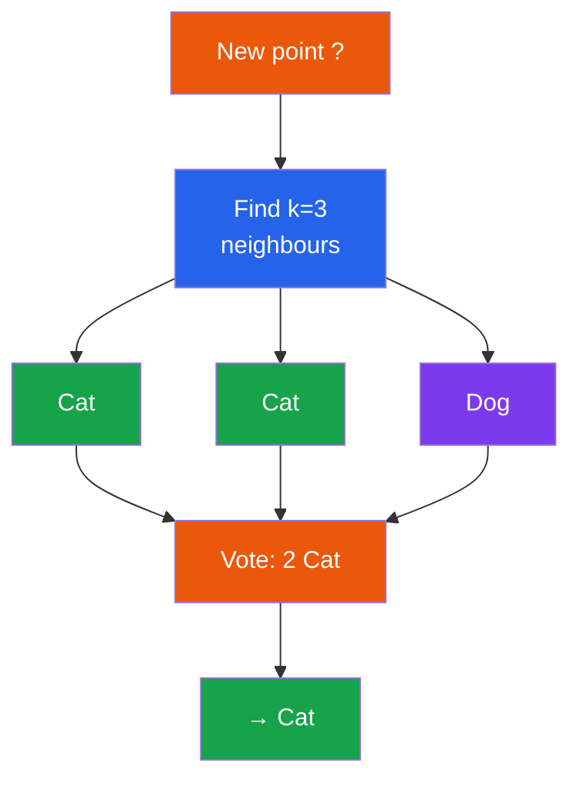

</div>

<div class="space-y-1">

### Choosing k

| k | Behaviour | Risk |
|:--|:----------|:-----|
| 1 | Exact nearest point | Overfitting |
| 5–10 | Smooth boundary | Sweet spot |
| 100+ | Very smooth | Underfitting |

Use **odd k** for binary to avoid ties.

### Distance metrics

| Metric | Formula |
|:-------|:--------|
| **Euclidean** | $\sqrt{\sum(x_i - y_i)^2}$ |
| **Manhattan** | $\sum\|x_i - y_i\|$ |

### Curse of Dimensionality

In high dimensions, all points become equidistant. Distance loses meaning → k-NN degrades.

**Fix:** Reduce dimensions (PCA) or use fewer features.

⚠️ **Always scale features** before using k-NN.

</div>

</div>

---

# Introduction to Neural Networks

<div class="grid grid-cols-2 gap-4 mt-2 text-sm leading-tight">

<div class="space-y-1">

### The Perceptron (single neuron)

$$z = w_1 x_1 + w_2 x_2 + \dots + b$$
$$\text{output} = f(z)$$

where $f$ is an **activation function**.

### Activation functions

| Function | Range | Used for |
|:---------|:------|:---------|
| **ReLU** $\max(0,z)$ | [0, ∞) | Hidden layers |
| **Sigmoid** | (0, 1) | Binary output |
| **Softmax** | (0,1) sums to 1 | Multi-class output |

**ReLU** in hidden layers by default. Sigmoid/Softmax only at the output.

</div>

<div class="space-y-1">

### Multi-Layer Perceptron

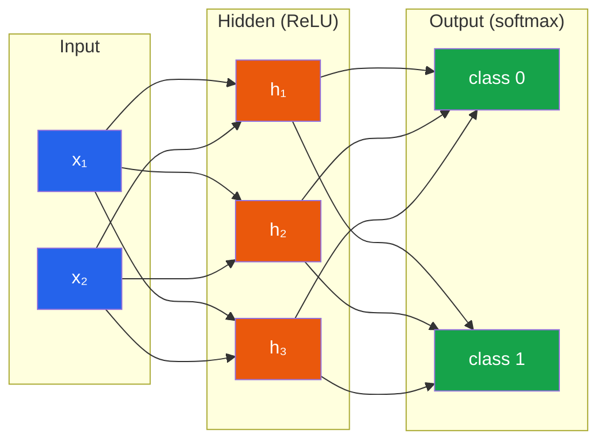

More layers = more capacity (deeper network).

Start with 1–2 hidden layers for tabular data.

</div>

</div>

---

# Training Neural Networks

<div class="grid grid-cols-2 gap-4 mt-2 text-sm leading-tight">

<div class="space-y-1">

### Gradient Descent

Imagine standing on a hill in fog — step downhill until you reach the bottom.

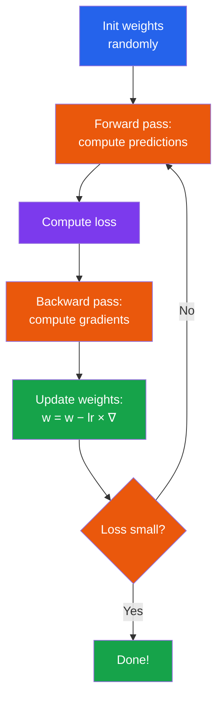

</div>

<div class="space-y-1">

### Key terms

| Term | Meaning |
|:-----|:--------|
| **Forward pass** | Push data through → predictions |
| **Loss** | How bad predictions are |
| **Gradient** | Direction of steepest ascent |
| **Backpropagation** | Compute all gradients efficiently |
| **Learning rate** | Step size (too big: overshoot; too small: slow) |
| **Epoch** | One full pass through training data |

### When to use NNs?

| Data type | Use NN? |
|:----------|:--------|
| Small tabular (< 10k) | **No** — use trees |
| Images | **Yes** — CNNs |
| Text / NLP | **Yes** — Transformers |
| Need interpretability | **No** — simpler models |

</div>

</div>

---
layout: section
---

# Part III
## Unsupervised Learning

---

# Clustering — k-Means

<div class="grid grid-cols-2 gap-4 mt-2 text-sm leading-tight">

<div class="space-y-1">

### What is clustering?

**No labels.** Group similar data points together based on features only.

Customer segmentation · Image compression · Document organisation · Anomaly detection

### k-Means algorithm

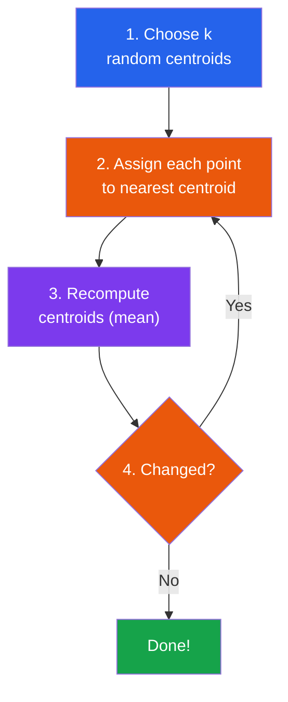

</div>

<div class="space-y-1">

### Properties

| Property | k-Means |
|:---------|:--------|
| Must specify k | Yes |
| Cluster shape | Spherical |
| Sensitive to init | Yes (use `n_init=10`) |
| Sensitive to outliers | Yes |
| Scales well | Very well |

### Code

<div class="text-xs leading-tight">

```python
from sklearn.cluster import KMeans

kmeans = KMeans(n_clusters=3,
                random_state=42, n_init=10)
kmeans.fit(X)

labels = kmeans.labels_
centroids = kmeans.cluster_centers_
```

</div>

</div>

</div>

---

# Choosing k & Other Clustering Methods

<div class="grid grid-cols-2 gap-4 mt-2 text-sm leading-tight">

<div class="space-y-1">

### Elbow Method

Plot **inertia** (within-cluster distance) vs k → look for the "bend".

### Silhouette Score

$$s_i = \frac{b_i - a_i}{\max(a_i, b_i)}$$

$a_i$ = avg distance to own cluster · $b_i$ = avg distance to nearest other

Range [−1, +1]. Higher = better separated.

### Hierarchical Clustering

No need to choose k upfront. Builds a tree (**dendrogram**) of progressive merges. Cut at desired height.

**Pros:** Shows structure at all levels

**Cons:** Slow for large datasets

</div>

<div class="space-y-1">

### DBSCAN (Density-Based)

Finds **arbitrary-shaped** clusters by looking for dense regions.

| Parameter | Meaning |
|:----------|:--------|
| `eps` | Max distance to be neighbours |
| `min_samples` | Min points for dense region |

### k-Means vs DBSCAN

| | k-Means | DBSCAN |
|:--|:--------|:-------|
| Specify k | Yes | No |
| Shape | Spherical | Arbitrary |
| Outliers | All assigned | Detects noise |
| Speed | Fast | Depends on eps |

</div>

</div>

---

# Dimensionality Reduction — PCA

<div class="grid grid-cols-2 gap-4 mt-2 text-sm leading-tight">

<div class="space-y-1">

### Why reduce dimensions?

Too many features → slow training, overfitting, can't visualise.

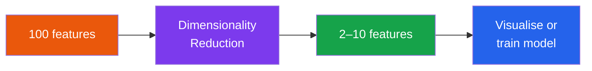

### PCA (Principal Component Analysis)

Finds new axes (**principal components**) capturing **maximum variance**.

1. Centre the data (subtract mean)
2. Find directions of max variance
3. Rank: PC1 > PC2 > PC3 …
4. Keep top k components

</div>

<div class="space-y-1">

### How much to keep?

Plot **cumulative explained variance** vs # components. Common rule: keep 95%.

### Key points

| Point | Detail |
|:------|:-------|
| **Always scale first** | PCA is sensitive to scales |
| **Linear method** | Finds straight-line directions |
| **Ordered** | PC1 captures most variance |
| **Orthogonal** | Each PC ⊥ to all others |

### PCA for preprocessing

<div class="text-xs leading-tight">

```python
from sklearn.decomposition import PCA
from sklearn.pipeline import Pipeline

pipe = Pipeline([
    ("scaler", StandardScaler()),
    ("pca", PCA(n_components=0.95)),
    ("clf", RandomForestClassifier()),
])
```

</div>

</div>

</div>

---

# t-SNE — Non-Linear Visualisation

<div class="grid grid-cols-2 gap-4 mt-2 text-sm leading-tight">

<div class="space-y-1">

### PCA vs t-SNE

| Feature | PCA | t-SNE |
|:--------|:----|:------|
| Type | Linear | Non-linear |
| Main use | General reduction | Visualisation only |
| Preserves | Global structure | Local structure |
| Speed | Very fast | Slow |
| Output dims | Any | Usually 2–3 |

### t-SNE intuition

- Points **close** in high-D stay **close** in 2D
- Points **far** can end up anywhere
- Great at revealing **clusters**
- Don't interpret distances between clusters

</div>

<div class="space-y-1">

### Perplexity parameter

| Perplexity | Effect |
|:-----------|:-------|
| Low (5–10) | Tight, small clusters |
| **30** (default) | **Balanced** |
| High (50–100) | Broader, clusters may merge |

### Code

<div class="text-xs leading-tight">

```python
from sklearn.manifold import TSNE
import matplotlib.pyplot as plt

tsne = TSNE(n_components=2,
            random_state=42, perplexity=30)
X_tsne = tsne.fit_transform(X_scaled)

plt.scatter(X_tsne[:, 0], X_tsne[:, 1],
            c=y, cmap="viridis", alpha=0.6)
plt.title("t-SNE Visualisation")
plt.show()
```

</div>

⚠️ t-SNE is for **visualisation only** — don't use as preprocessing for classifiers. Use PCA instead.

</div>

</div>

---
layout: section
---

# Part IV
## Putting It All Together

---

# The Complete ML Pipeline

<div class="mt-1">

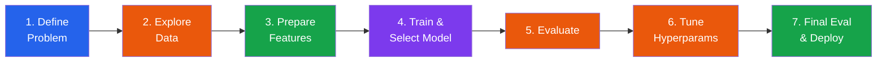

</div>

<div class="grid grid-cols-2 gap-4 mt-2 text-sm leading-tight">

<div class="space-y-1">

### Step 1: Define the problem

What am I predicting? · Classification or regression? · Which metric matters? · What data do I have?

### Step 2: EDA checklist

Shape · Types · Missing values · Distributions · Correlations · Outliers

### Step 3: Feature engineering

Impute missing · Encode categories · Scale numericals · Create domain features · Log-transform skewed data

</div>

<div class="space-y-1">

### Step 4: Model selection

Try several models with **cross-validation**:

<div class="text-xs leading-tight">

```python
models = {
    "LogReg": LogisticRegression(),
    "RF": RandomForestClassifier(),
    "GBM": GradientBoostingClassifier(),
    "k-NN": KNeighborsClassifier(),
}
for name, m in models.items():
    scores = cross_val_score(
        m, X_train, y_train, cv=5)
    print(f"{name}: {scores.mean():.3f}")
```

</div>

### Steps 5–7

Evaluate with proper metrics → Tune with `GridSearchCV` → Final test set evaluation **once**

</div>

</div>

---

# Scikit-Learn Pipelines & Data Leakage

<div class="grid grid-cols-2 gap-4 mt-2 text-sm leading-tight">

<div class="space-y-1">

### Data leakage: the #1 beginner mistake

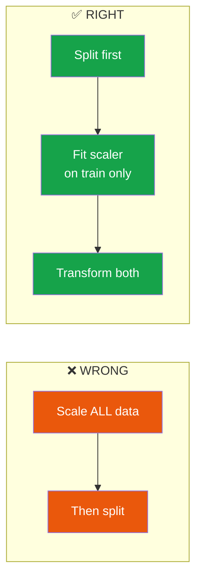

**Pipelines prevent leakage** by chaining preprocessing + model into one object.

</div>

<div class="space-y-1">

### Pipeline with mixed features

<div class="text-xs leading-tight">

```python
from sklearn.pipeline import Pipeline
from sklearn.compose import ColumnTransformer
from sklearn.preprocessing import (
    StandardScaler, OneHotEncoder)
from sklearn.impute import SimpleImputer

num_pipe = Pipeline([
    ("imputer", SimpleImputer(strategy="median")),
    ("scaler", StandardScaler()),
])
cat_pipe = Pipeline([
    ("imputer", SimpleImputer(
        strategy="most_frequent")),
    ("encoder", OneHotEncoder(
        handle_unknown="ignore")),
])
preprocessor = ColumnTransformer([
    ("num", num_pipe, num_features),
    ("cat", cat_pipe, cat_features),
])
full_pipe = Pipeline([
    ("preprocess", preprocessor),
    ("model", GradientBoostingClassifier()),
])
full_pipe.fit(X_train, y_train)
```

</div>

</div>

</div>

---

# Hyperparameter Tuning

<div class="grid grid-cols-2 gap-4 mt-2 text-sm leading-tight">

<div class="space-y-1">

### Grid Search vs Random Search

| Method | How | Pros | Cons |
|:-------|:----|:-----|:-----|
| **Grid** | All combos | Thorough | Slow |
| **Random** | Sample random | Faster | May miss best |

### Grid Search example

<div class="text-xs leading-tight">

```python
from sklearn.model_selection import GridSearchCV

param_grid = {
    "model__n_estimators": [100, 200, 300],
    "model__max_depth": [3, 5, 10, None],
    "model__learning_rate": [0.05, 0.1, 0.2],
}
grid = GridSearchCV(
    full_pipe, param_grid,
    cv=5, scoring="f1", n_jobs=-1
)
grid.fit(X_train, y_train)

print(f"Best: {grid.best_params_}")
print(f"CV F1: {grid.best_score_:.3f}")
```

</div>

`model__` prefix targets the pipeline step named `"model"`.

</div>

<div class="space-y-1">

### Final evaluation

<div class="text-xs leading-tight">

```python
from sklearn.metrics import (
    classification_report, confusion_matrix)

best = grid.best_estimator_
y_pred = best.predict(X_test)

print(classification_report(y_test, y_pred))

cm = confusion_matrix(y_test, y_pred)
sns.heatmap(cm, annot=True, fmt="d",
            cmap="Blues")
plt.title("Test Confusion Matrix")
plt.show()
```

</div>

### Golden rules

- ⚠️ **Never tune on the test set**
- ⚠️ **Test set used exactly once** — at the very end
- ⚠️ **Always cross-validate** during development
- ⚠️ **Pipeline wraps everything** — prevents leakage

</div>

</div>

---

# Ethics & Limitations of ML

<div class="grid grid-cols-2 gap-4 mt-2 text-sm leading-tight">

<div class="space-y-1">

### How bias enters models

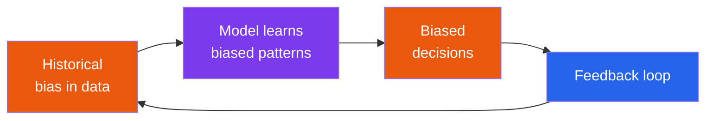

Data collection · Labelling · Feature choice · Training · Evaluation · Deployment — bias can enter at **every stage**.

### Types of fairness

| Criterion | Definition |
|:----------|:----------|
| **Demographic parity** | Equal acceptance rate across groups |
| **Equal opportunity** | Equal TPR across groups |
| **Individual fairness** | Similar people → similar predictions |

</div>

<div class="space-y-1">

### Interpretability spectrum

| Model | Interpretability |
|:------|:----------------|
| Linear / Logistic Reg | **High** |
| Decision Tree | **High** |
| Random Forest | **Medium** |
| Neural Network | **Low** |

### What ML cannot do

- Can't reason **causally** (correlation ≠ causation)
- Can't **generalise** beyond training data
- Can't handle **rare events** well
- Can't replace **domain expertise**
- Can't guarantee **fairness** automatically

### Privacy basics

Minimise data · Anonymise · Aggregate · Access control · Know **GDPR** / **AI Act**

</div>

</div>

---

# Responsible ML Checklist

<div class="grid grid-cols-2 gap-4 mt-2 text-sm leading-tight">

<div class="space-y-1">

### 8 questions for every project

<div class="border border-purple-400 rounded-lg p-3 space-y-1">

1. Is ML the **right tool** for this problem?
2. Is the data **representative** and fair?
3. Are **protected attributes** handled properly?
4. Performance checked **across groups**?
5. Can you **explain** the model's decisions?
6. Is personal data **protected**?
7. What's the **worst that could happen**?
8. Is there **human oversight**?

</div>

</div>

<div class="space-y-1">

### Practical guidance

| # | Action |
|:--|:-------|
| 1 | Consider if simple rules would work |
| 2 | Check class balance & demographic coverage |
| 3 | Watch for proxy features (postcode → ethnicity) |
| 4 | Report metrics **per subgroup** |
| 5 | Use interpretable models for high-stakes |
| 6 | Follow data minimisation; comply with regs |
| 7 | Think about failure modes & impact |
| 8 | Keep humans in the loop for critical decisions |

### Key regulations

**GDPR** (EU) — Right to explanation, right to be forgotten

**AI Act** (EU) — Risk-based classification of AI systems

**CCPA** (California) — Right to know, right to delete

</div>

</div>

---
layout: section
---

# Summary
## Key Takeaways

---

# Course Recap

<div class="grid grid-cols-2 gap-4 mt-2 text-sm leading-tight">

<div class="space-y-1">

### Supervised Learning

<div class="border border-purple-400 rounded-lg p-3 space-y-1">

**Linear Regression** — fit a line, predict numbers

**Logistic Regression** — sigmoid, predict probabilities

**Decision Trees** — flowchart, interpretable rules

**Ensembles** — combine models (RF, Boosting)

**k-NN** — vote of nearest neighbours

**Neural Networks** — layers of neurons, gradient descent

</div>

### Unsupervised Learning

<div class="border border-orange-400 rounded-lg p-3 space-y-1">

**k-Means** — partition into k spherical clusters

**Hierarchical** — dendrogram, no k needed

**PCA** — reduce dimensions, max variance

**t-SNE** — non-linear visualisation

</div>

</div>

<div class="space-y-1">

### The ML Pipeline

<div class="border border-blue-400 rounded-lg p-3 space-y-1">

1. Define problem & metric
2. Explore & understand data
3. Prepare features (encode, scale, impute)
4. Train & compare models (cross-validation)
5. Tune hyperparameters (grid search)
6. Final evaluation on test set (once!)
7. Deploy & monitor

</div>

### Ethics & Best Practices

<div class="border border-green-400 rounded-lg p-3 space-y-1">

- Bias enters at every stage — **check for it**
- Use **interpretable** models when stakes are high
- **Pipelines** prevent data leakage
- **Never** tune on the test set
- ML ≠ magic — it amplifies what's in the data

</div>

</div>

</div>

---

# Model Selection Guide

<div class="mt-2">

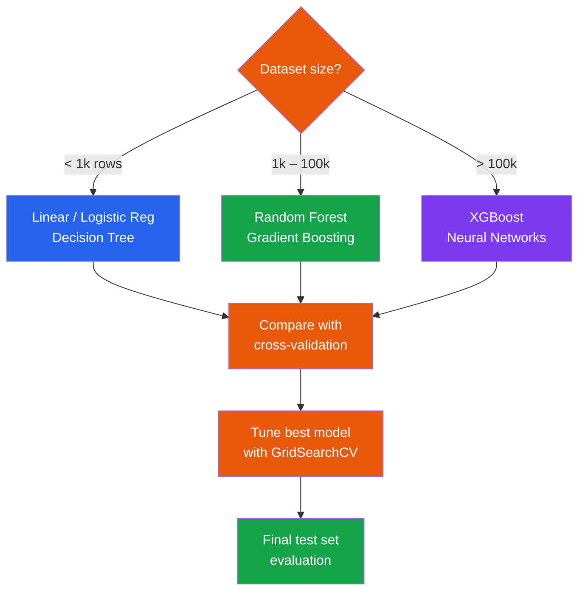

</div>

<div class="grid grid-cols-3 gap-4 mt-2 text-sm">

<div class="bg-purple-50 dark:bg-purple-900 rounded-lg p-3">

**Tabular data?**
Tree-based models first (RF, GBM). NNs rarely help.

</div>

<div class="bg-orange-50 dark:bg-orange-900 rounded-lg p-3">

**Images / Text / Audio?**
Neural networks (CNNs, Transformers) are the way to go.

</div>

<div class="bg-blue-50 dark:bg-blue-900 rounded-lg p-3">

**Need explainability?**
Linear models or decision trees. Avoid deep learning.

</div>

</div>

---
layout: center
class: text-center
---

# What to Learn Next

<div class="grid grid-cols-3 gap-4 mt-4 text-left text-sm">

<div class="border border-purple-400 rounded-lg p-3">

### Immediate
- Regularisation (Ridge, Lasso)
- XGBoost / LightGBM
- Feature selection
- Imbalanced data handling

</div>

<div class="border border-orange-400 rounded-lg p-3">

### Deep Learning
- PyTorch / TensorFlow
- CNNs (images)
- Transformers (text)
- Generative AI (LLMs)

</div>

<div class="border border-blue-400 rounded-lg p-3">

### Resources
- *Hands-On ML* (Géron)
- *Intro to Stat. Learning*
- Fast.ai courses
- Kaggle competitions
- MSc Study Guide →

</div>

</div>

<div class="mt-6 text-sm text-gray-400">

The best way to learn ML is to **practise with real data**. Pick a dataset, define a question, build a model end to end.

</div>
